# Logic Apps Workflows

This document contains Mermaid flowchart diagrams for all Logic Apps workflows in the Transgrid solution.

> **Repository:** [https://github.com/frkim/transgrid](https://github.com/frkim/transgrid)

---

## Table of Contents

1. [RNE Daily Export](#rne-daily-export)
2. [RNE D+2 Export](#rne-d2-export)
3. [RNE Retry Failed](#rne-retry-failed)
4. [RNE HTTP Trigger](#rne-http-trigger)
5. [Salesforce Negotiated Rates](#salesforce-negotiated-rates)
6. [Network Rail CIF Processing](#network-rail-cif-processing)

---

## RNE Daily Export

**Source:** [sources/logicapps/rne-daily-export/workflow.json](https://github.com/frkim/transgrid/blob/main/sources/logicapps/rne-daily-export/workflow.json)

**Trigger:** Daily at 06:00 (Romance Standard Time)

---

## RNE D+2 Export

**Source:** [sources/logicapps/rne-d2-export/workflow.json](https://github.com/frkim/transgrid/blob/main/sources/logicapps/rne-d2-export/workflow.json)

**Trigger:** Daily at 06:30 (Romance Standard Time)

```mermaid
flowchart TB
    subgraph Trigger
        T1[/"⏰ Recurrence_D2_Export<br/>Daily at 06:30"/]
    end

    subgraph Initialization
        V1["Initialize_RunId<br/>📋 guid()"]
        V2["Initialize_TravelDate_D2<br/>📅 Today + 2 days"]
        V3["Initialize_FailedTrains<br/>📋 Empty array"]
        V4["Initialize_SuccessCount<br/>🔢 0"]
    end

    subgraph GraphQL["GraphQL API Call"]
        Q1["🌐 Query_GraphQL_API_D2<br/>POST /graphql"]
        P1["📄 Parse_GraphQL_Response"]
        P2["🔍 Filter_Active_FR_GB_Plans<br/>Country: FR/GB<br/>Status: ACTIVE<br/>Not EVOLUTION"]
    end

    subgraph ForEach["For Each Train Plan (Concurrency: 5)"]
        TR1["⚡ Transform_JSON_to_XML<br/>Azure Function"]
        
        subgraph UploadScope["Scope: Upload Success"]
            U1["🗑️ Delete_Existing_Blob"]
            U2["📦 Archive_to_Blob"]
            U3["📁 Create_SFTP_Folder_Primary"]
            U4["📤 Upload_to_Primary_SFTP"]
            U5["📁 Create_SFTP_Folder_Backup"]
            U6["📤 Upload_to_Backup_SFTP"]
            U7["➕ Increment_Success"]
        end
        
        subgraph FailureScope["Scope: Handle Failure"]
            F1["📝 Append_Failed_Train"]
        end
    end

    subgraph StoreFailures["Store Failed Exports"]
        SF1{"Condition_Has_Failures<br/>FailedTrains > 0?"}
        SF2["For_Each_Failed_Train"]
        SF3["💾 Insert_Failed_Export_Record<br/>WorkflowType: D2_EXPORT"]
    end

    T1 --> V1 --> V2 --> V3 --> V4 --> Q1
    Q1 --> P1 --> P2 --> TR1
    
    TR1 --> U1 --> U2 --> U3 --> U4 --> U5 --> U6 --> U7
    U1 -.->|Failed/TimedOut| F1
    
    U7 --> SF1
    F1 --> SF1
    
    SF1 -->|Yes| SF2 --> SF3
    SF1 -->|No| END1([End])
    SF3 --> END1
```

---

## RNE Retry Failed

**Source:** [sources/logicapps/rne-retry-failed/workflow.json](https://github.com/frkim/transgrid/blob/main/sources/logicapps/rne-retry-failed/workflow.json)

**Trigger:** Daily at 07:00 (Romance Standard Time)

```mermaid
flowchart TB
    subgraph Trigger
        T1[/"⏰ Recurrence_Retry_Failed<br/>Daily at 07:00"/]
    end

    subgraph Initialization
        V1["Initialize_RunId<br/>📋 guid()"]
        V2["Initialize_TodayDate<br/>📅 Today"]
        V3["Initialize_MaxRetries<br/>🔢 3"]
    end

    subgraph QueryFailed["Query Failed Exports"]
        QF1["🔍 Query_Failed_Exports<br/>Azure Table: FailedExports<br/>Filter: RetryCount < MaxRetries"]
        QF2["📄 Parse_Failed_Exports"]
    end

    subgraph ForEach["For Each Failed Export (Sequential)"]
        FE1["🌐 Get_Train_Plan_By_Id<br/>GraphQL Query"]
        FE2["📄 Parse_Train_Plan"]
        FE3["⚡ Transform_JSON_to_XML<br/>Azure Function"]
        
        subgraph RetryUpload["Scope: Retry Upload"]
            RU1["🗑️ Delete_Existing_Blob"]
            RU2["📦 Archive_to_Blob<br/>*_retry.xml"]
            RU3["📁 Create_SFTP_Folder_Primary"]
            RU4["📤 Upload_to_Primary_SFTP"]
            RU5["✅ Delete_Retry_Record<br/>Remove from FailedExports"]
        end
        
        subgraph IncrementRetry["Scope: Increment Retry"]
            IR1["🔄 Update_Retry_Count<br/>RetryCount + 1"]
        end
    end

    T1 --> V1 --> V2 --> V3 --> QF1
    QF1 --> QF2 --> FE1
    FE1 --> FE2 --> FE3 --> RU1
    
    RU1 --> RU2 --> RU3 --> RU4 --> RU5
    
    RU1 -.->|Failed/TimedOut| IR1
    RU2 -.->|Failed/TimedOut| IR1
    RU4 -.->|Failed/TimedOut| IR1
    
    RU5 --> END1([End])
    IR1 --> END1
```

---

## RNE HTTP Trigger

**Source:** [sources/logicapps/rne-http-trigger/workflow.json](https://github.com/frkim/transgrid/blob/main/sources/logicapps/rne-http-trigger/workflow.json)

**Trigger:** HTTP POST (Manual/On-demand)

```mermaid
flowchart TB
    subgraph Trigger
        T1[/"🌐 Manual_HTTP_Trigger<br/>POST Request<br/>travelDate, exportType, trainIds"/]
    end

    subgraph Initialization
        V1["Initialize_RunId"]
        V2["Initialize_TravelDate<br/>From request or today"]
        V3["Initialize_ExportType<br/>DAILY/D+2/ADHOC"]
        V4["Initialize_RequestedTrainIds<br/>Optional filter"]
        V5["Initialize_SuccessCount"]
        V6["Initialize_FailedTrains"]
    end

    subgraph GraphQL["GraphQL & Filtering"]
        Q1["🌐 Query_GraphQL_API"]
        Q2["📄 Parse_GraphQL_Response"]
        Q3["🔍 Filter_Active_FR_GB_Plans"]
        Q4["Initialize_FilteredPlans"]
        Q5{"Condition_Filter_Specific_Trains<br/>trainIds provided?"}
        Q6["🔍 Filter_By_Requested_Ids"]
        Q7["Set_FilteredPlans_Specific"]
        Q8["Set_FilteredPlans_All"]
    end

    subgraph ForEach["For Each Train Plan (Concurrency: 5)"]
        TR1["⚡ Transform_JSON_to_XML"]
        
        subgraph UploadScope["Scope: Upload Success"]
            U1["🗑️ Delete_Existing_Blob"]
            U2["📦 Archive_to_Blob<br/>*_{ExportType}.xml"]
            U3["📁 Create_SFTP_Folder_Primary"]
            U4["📤 Upload_to_Primary_SFTP"]
            U5["📁 Create_SFTP_Folder_Backup"]
            U6["📤 Upload_to_Backup_SFTP"]
            U7["➕ Increment_Success_Count"]
        end
        
        subgraph FailureScope["Scope: Handle Failure"]
            F1["📝 Append_Failed_Train"]
        end
    end

    subgraph StoreFailures["Store & Respond"]
        SF1{"Condition_Has_Failures?"}
        SF2["For_Each_Failed_Train"]
        SF3["💾 Insert_Failed_Export_Record<br/>TriggeredBy: HTTP_MANUAL"]
        R1["📤 Response_Success<br/>HTTP 200<br/>Summary with counts"]
    end

    T1 --> V1 --> V2 --> V3 --> V4 --> V5 --> V6
    V6 --> Q1 --> Q2 --> Q3 --> Q4 --> Q5
    
    Q5 -->|Yes| Q6 --> Q7 --> TR1
    Q5 -->|No| Q8 --> TR1
    
    TR1 --> U1 --> U2 --> U3 --> U4 --> U5 --> U6 --> U7
    U1 -.->|Failed| F1
    
    U7 --> SF1
    F1 --> SF1
    
    SF1 -->|Yes| SF2 --> SF3 --> R1
    SF1 -->|No| R1
    R1 --> END1([End])
```

---

## Salesforce Negotiated Rates

**Source:** [sources/logicapps/sf-negotiated-rates/workflow.json](https://github.com/frkim/transgrid/blob/main/sources/logicapps/sf-negotiated-rates/workflow.json)

**Trigger:** Azure Service Bus Queue Message

```mermaid
flowchart TB
    subgraph Trigger
        T1[/"📨 When_messages_are_available_in_queue<br/>Service Bus Queue<br/>splitOn: body"/]
    end

    subgraph Initialization
        V1["Initialize_RunId"]
        V2["Initialize_ProcessedCount<br/>🔢 0"]
        V3["Initialize_FailedRoutes<br/>📋 Empty array"]
        V4["📄 Parse_Event_Data<br/>eventType, negotiatedRateIds"]
    end

    subgraph GetRates["Get Negotiated Rates"]
        G1["🌐 Get_Negotiated_Rates_From_API<br/>POST /api/Salesforce/getNegotiatedRates"]
        G2{"Check_API_Response<br/>HTTP 200?"}
    end

    subgraph Transform["Transform to CSV"]
        TR1["⚡ Transform_Rates_To_CSV<br/>Azure Function<br/>Route: ALL"]
        TR2["📄 Parse_Transform_Response"]
    end

    subgraph ForEach["Process Each Route (Concurrency: 3)"]
        FE1{"Check_Route_Success?"}
        
        subgraph SuccessPath["Route Success"]
            S1["🎯 Determine_Container<br/>BENE → salesforce-external<br/>Others → salesforce-internal"]
            S2["📁 Determine_Path_Prefix<br/>BENE → root<br/>Others → {routeCode}/"]
            S3["📦 Upload_CSV_To_Blob<br/>{prefix}{yyyyMM}/{timestamp}_{file}.csv"]
            S4["➕ Increment_Processed_Count"]
        end
        
        subgraph FailurePath["Route Failure"]
            F1["📝 Append_Failed_Route"]
        end
    end

    subgraph UpdateSalesforce["Update Salesforce & Log"]
        U1["🌐 Update_Salesforce_Status<br/>POST /api/Salesforce/updateExtractStatus<br/>status: Extracted/PartiallyExtracted"]
        U2["💾 Log_Extract_Record<br/>Azure Table: SalesforceExtracts"]
    end

    subgraph ErrorPath["API Error"]
        E1["💾 Log_API_Error"]
        E2["❌ Terminate_On_API_Error"]
    end

    T1 --> V1 --> V2 --> V3 --> V4
    V4 --> G1 --> G2
    
    G2 -->|Yes| TR1 --> TR2 --> FE1
    G2 -->|No| E1 --> E2
    
    FE1 -->|Success| S1 --> S2 --> S3 --> S4
    FE1 -->|Failed| F1
    
    S4 --> U1
    F1 --> U1
    
    U1 --> U2 --> END1([End])
```

---

## Network Rail CIF Processing

**Source:** [sources/logicapps/nr-cif-processing/workflow.json](https://github.com/frkim/transgrid/blob/main/sources/logicapps/nr-cif-processing/workflow.json)

**Trigger:** HTTP POST (On-demand orchestration)

```mermaid
flowchart TB
    subgraph Trigger
        T1[/"🌐 Manual_HTTP_Trigger<br/>POST Request<br/>fileType, forceRefresh"/]
    end

    subgraph Initialization
        V1["Initialize_RunId<br/>📋 guid()"]
        V2["Initialize_ProcessingStats<br/>📊 totalRecords: 0<br/>processedRecords: 0<br/>filteredRecords: 0<br/>publishedEvents: 0"]
    end

    subgraph ProcessCIF["CIF Processing"]
        C1["⚡ Call_CIF_Processing_Function<br/>POST /api/ProcessCifOnDemand<br/>Timeout: 10 minutes"]
        C2["📄 Parse_Function_Response<br/>processId, status, statistics"]
    end

    subgraph CheckStatus["Check Processing Status"]
        CS1{"Check_Processing_Status<br/>status == 'completed'?"}
        
        subgraph SuccessPath["Success"]
            S1["💾 Log_Success_To_Table<br/>Azure Table: CifProcessingLogs<br/>Status: Completed"]
        end
        
        subgraph FailurePath["Failure"]
            F1["💾 Log_Failure_To_Table<br/>Azure Table: CifProcessingLogs<br/>Status: Failed"]
            F2["❌ Terminate_On_Failure<br/>CifProcessingFailed"]
        end
    end

    subgraph Response
        R1["📤 Response_Success<br/>HTTP 200<br/>runId, status, statistics"]
    end

    T1 --> V1 --> V2 --> C1
    C1 --> C2 --> CS1
    
    CS1 -->|Yes| S1 --> R1
    CS1 -->|No| F1 --> F2
    
    R1 --> END1([End])
```

---

## Workflow Summary

| Workflow | Trigger | Purpose | Key Actions |
|----------|---------|---------|-------------|
| [rne-daily-export](#rne-daily-export) | ⏰ Daily 06:00 | Export today's train plans | GraphQL → Transform → Blob + SFTP |
| [rne-d2-export](#rne-d2-export) | ⏰ Daily 06:30 | Export D+2 train plans | GraphQL → Transform → Blob + SFTP |
| [rne-retry-failed](#rne-retry-failed) | ⏰ Daily 07:00 | Retry failed exports | Query Table → Transform → Upload |
| [rne-http-trigger](#rne-http-trigger) | 🌐 HTTP POST | On-demand export | GraphQL → Filter → Transform → Upload |
| [sf-negotiated-rates](#salesforce-negotiated-rates) | 📨 Service Bus | Process rate extracts | API → CSV Transform → Blob Upload |
| [nr-cif-processing](#network-rail-cif-processing) | 🌐 HTTP POST | CIF file processing | Function Call → Log Results |

---

## Connection Dependencies

```mermaid
flowchart LR
    subgraph Connections
        C1["🔌 AzureBlob"]
        C2["🔌 SftpPrimary"]
        C3["🔌 SftpBackup"]
        C4["🔌 AzureTables"]
        C5["🔌 serviceBus"]
    end

    subgraph Workflows
        W1["rne-daily-export"]
        W2["rne-d2-export"]
        W3["rne-retry-failed"]
        W4["rne-http-trigger"]
        W5["sf-negotiated-rates"]
        W6["nr-cif-processing"]
    end

    W1 --> C1
    W1 --> C2
    W1 --> C3
    W1 --> C4

    W2 --> C1
    W2 --> C2
    W2 --> C3
    W2 --> C4

    W3 --> C1
    W3 --> C2
    W3 --> C4

    W4 --> C1
    W4 --> C2
    W4 --> C3
    W4 --> C4

    W5 --> C1
    W5 --> C4
    W5 --> C5

    W6 --> C4
```

