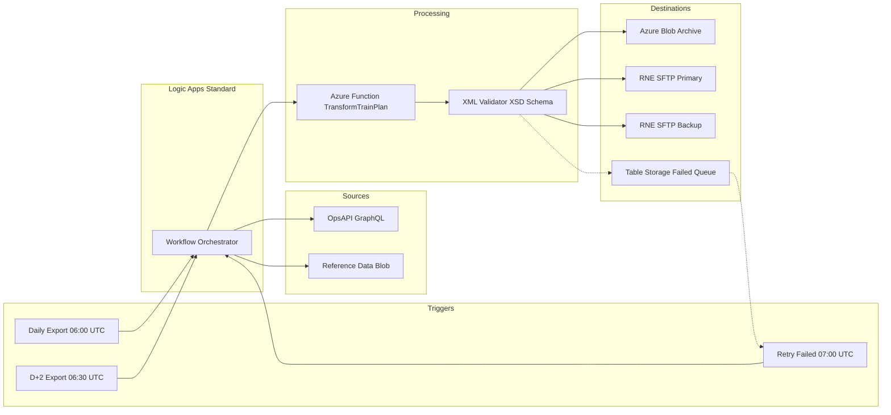
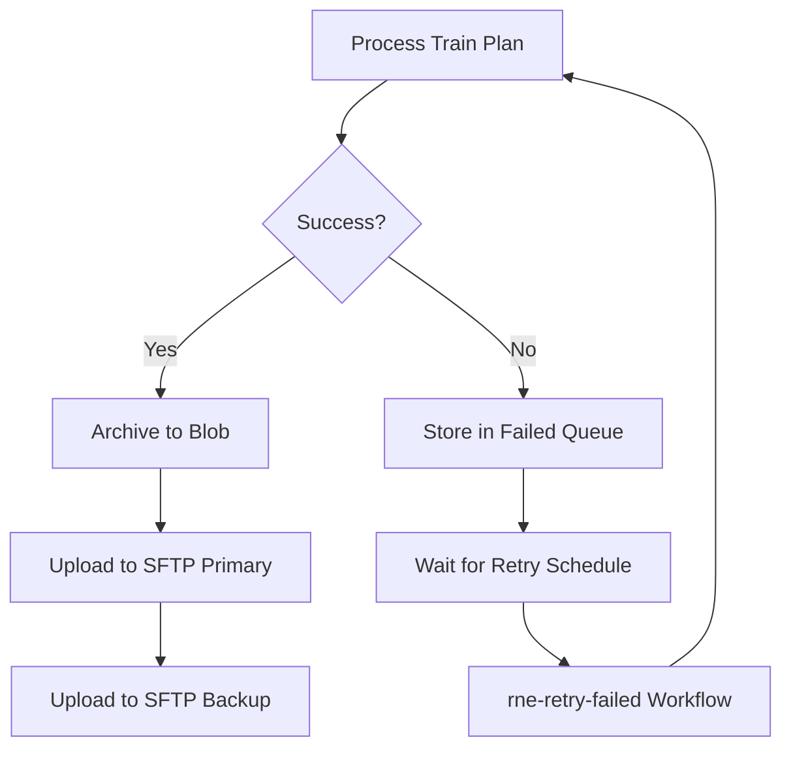
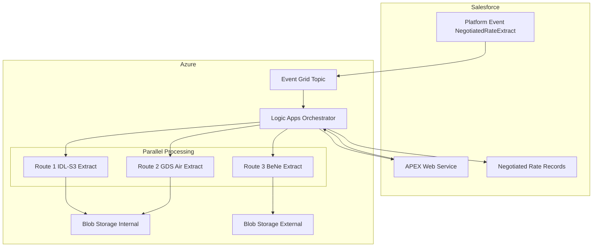
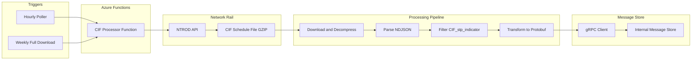
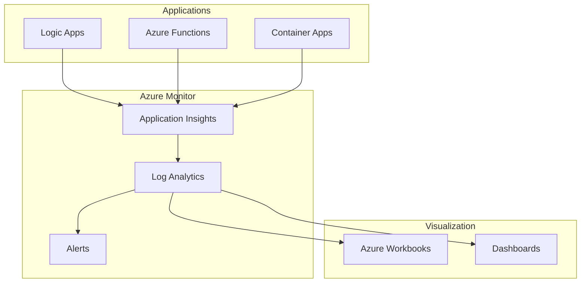
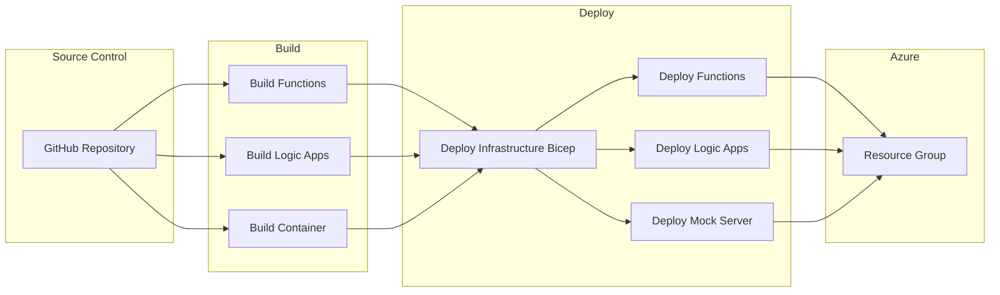

# Azure Integration Services - Use Case Implementation Details

This document provides detailed implementation guidance for the three integration use cases using Azure Integration Services.

---

## Overview

| Use Case | Primary Service | Trigger Type | Complexity |
|----------|----------------|--------------|------------|
| RNE Operational Plans Export | Logic Apps Standard | Scheduled (Cron) | Medium |
| Salesforce Negotiated Rates | Logic Apps + Functions | Event-Driven | High |
| Network Rail CIF Processing | Azure Functions | Scheduled (Cron) | High |

---

## Use Case 1: RNE Operational Plans Export

### Description

The RNE Operational Plans Export is a **scheduled batch integration** that automatically exports train operational plans to Rail Network Europe (RNE) for cross-border railway coordination. Every day, Eurostar trains crossing the Channel Tunnel must communicate their composition, weight, and schedule to RNE for infrastructure planning and capacity management.

**Functionally**, the system retrieves train plans from Eurostar's internal Operations API (GraphQL), transforms them into the European TAF-JSG XML standard format, validates them against the official XSD schema, and delivers them to RNE via SFTP. The process handles three scenarios: daily exports for tomorrow's trains (D-1), advance exports for trains two days ahead (D+2), and automatic retry of any previously failed exports.

**Technically**, the solution uses Azure Logic Apps Standard for workflow orchestration with three cron-triggered workflows. An Azure Function handles the complex JSON-to-XML transformation and XSD validation. Failed exports are tracked in Azure Table Storage and automatically retried in subsequent runs. All XML files are archived in Azure Blob Storage for audit purposes before being uploaded to both primary and backup RNE SFTP servers.

### Architecture Diagram



### Implementation Components

#### 1. Logic Apps Workflows

| Workflow | Schedule | Purpose |
|----------|----------|---------|
| `rne-daily-export` | 06:00 UTC | Export D-1 operational plans |
| `rne-d2-export` | 06:30 UTC | Export D+2 future plans |
| `rne-retry-failed` | 07:00 UTC | Retry previously failed exports |
| `rne-http-trigger` | On-demand | Manual/API-triggered export |

#### 2. Azure Function: TransformTrainPlan

**Purpose:** Transform JSON train plan data to TAF-JSG XML format

**Input:**
```json
{
  "trainPlan": {
    "serviceCode": "ES9012",
    "travelDate": "2026-01-19",
    "origin": "FRPNO",
    "destination": "GBSPX",
    "passagePoints": []
  },
  "referenceData": {
    "locationCodes": {},
    "vehicleWeights": {}
  }
}
```

**Output:**
```xml
<?xml version="1.0" encoding="UTF-8"?>
<PassengerTrainCompositionProcessMessage>
  <TrainComposition>
    <OperationalTrainNumber>9012</OperationalTrainNumber>
    <TravelDate>2026-01-19</TravelDate>
  </TrainComposition>
</PassengerTrainCompositionProcessMessage>
```

#### 3. Error Handling and Retry Pattern



### Configuration

| Setting | Value | Description |
|---------|-------|-------------|
| `OpsApi:Endpoint` | `https://...` | GraphQL API endpoint |
| `RneSftp:PrimaryHost` | `sftp.rne.eu` | Primary SFTP server |
| `RneSftp:BackupHost` | `sftp2.rne.eu` | Backup SFTP server |
| `BlobStorage:Container` | `ci-rne-export` | Archive container |

---

## Use Case 2: Salesforce Negotiated Rates Export

### Description

The Salesforce Negotiated Rates Export is an **event-driven integration** that processes corporate discount agreements whenever they're approved in Salesforce. When sales managers finalize negotiated rates for business customers, the system automatically generates extract files for multiple distribution channels and booking systems.

**Functionally**, when a negotiated rate record is approved in Salesforce, a Platform Event is published that triggers the integration. The system retrieves the full rate details via an APEX web service call, then processes three parallel extract types: IDL/S3 (for internal distribution), GDS Air (for Amadeus, Galileo, Sabre travel agency systems), and BeNe (for Belgian/Dutch external partners). Each extract generates CSV files with specific formats and uploads them to designated Azure Blob containers. Finally, the system updates Salesforce to mark records as extracted.

**Technically**, the solution uses a Salesforce Platform Event subscription as the trigger, connected via the Salesforce connector in Logic Apps. The scatter-gather pattern enables parallel processing of the three extract types for optimal performance. Complex filtering and transformation logic maps Salesforce objects (Negotiated_Rate__c, Contract, Account) to the required CSV formats. The workflow handles both "Priority" and "Normal" file generation for each route.

### Architecture Diagram



### Scatter-Gather Pattern Implementation

The workflow uses parallel processing to handle three different extract types simultaneously:

```csharp
// Pseudo-code for parallel processing
var tasks = new[]
{
    ProcessIdlS3Extract(negotiatedRates),
    ProcessGdsAirExtract(negotiatedRates),
    ProcessBeNeExtract(negotiatedRates)
};

await Task.WhenAll(tasks);
await UpdateSalesforceRecords(negotiatedRates);
```

### CSV Output Formats

#### Route 1 - IDL/S3 Extract
```csv
Account Manager,Account Name,Unique Code,Type,Road,Tariff Codes,Discounts,Action Type
John Smith,Acme Corp,ACME001,GND BE,LON-PAR,STD|FLEX,10%|15%,CREATE
```

#### Route 2 - GDS Air Extract
```csv
Account Manager,Account Name,Unique Code,GDS Used,PCC,Road,Tariff Codes,Dates,Action Type
Jane Doe,TravelCo,TC002,Amadeus,LONTP23,LON-BRU,BUS|PREM,2026-01-01|2026-12-31,UPDATE
```

#### Route 3 - BeNe Extract
```csv
Account Manager,Account Name,Unique Code,Distributor,Road,Tariff Codes,Action Type
Bob Wilson,EuroTravel,ET003,Thalys,PAR-BRU,ECO|COMF,CREATE
```

### Salesforce Integration Points

| Integration | Type | Purpose |
|-------------|------|---------|
| Platform Events | Inbound | Trigger workflow on NegotiatedRateExtract |
| APEX Web Service | Outbound | Call getNegotiatedRateExtracts for full data |
| SOQL Query | Outbound | Fetch Account PCC information |
| Record Update | Outbound | Update extraction status flags |

---

## Use Case 3: Network Rail CIF File Processing

### Description

The Network Rail CIF File Processing is a **scheduled file-based integration** that downloads and processes UK rail schedule data from Network Rail's NTROD (Network Rail Train Operator Data) service. This data is essential for Eurostar to understand connecting train services at UK stations and plan passenger journeys that involve transfers to domestic rail services.

**Functionally**, the system downloads Common Interface Format (CIF) schedule files that contain the complete UK rail timetable. These files are published by Network Rail and include information about all passenger and freight train movements. The integration filters for relevant planning schedules, extracts passage point information, and publishes events that enable Eurostar's journey planning systems to offer accurate connections to UK domestic trains.

**Technically**, the solution uses Azure Functions with a Timer trigger (hourly for updates, weekly for full refresh). The CIF files are large GZIP-compressed archives containing newline-delimited JSON (NDJSON). To avoid memory issues, the function uses streaming decompression and line-by-line parsing. Each relevant schedule is transformed to a Protobuf message and published to an internal message store via gRPC. Deduplication logic prevents duplicate event publication.

### Architecture Diagram



### Memory Management Strategy

Due to large file sizes, the implementation uses streaming:

```csharp
public async Task ProcessCifFileAsync(Stream gzipStream)
{
    using var decompressor = new GZipStream(gzipStream, CompressionMode.Decompress);
    using var reader = new StreamReader(decompressor);
    
    string? line;
    while ((line = await reader.ReadLineAsync()) != null)
    {
        if (TryParseSchedule(line, out var schedule))
        {
            if (ShouldProcess(schedule))
            {
                var protoEvent = MapToProtobuf(schedule);
                await PublishEventAsync(protoEvent);
            }
        }
    }
}
```

### Filtering Rules

| Field | Condition | Purpose |
|-------|-----------|---------|
| CIF_stp_indicator | == N | Only planning schedules |
| schedule_location | Must exist | Has valid location data |
| JsonScheduleV1 | Record type | Valid schedule record |

### Event Schema (Protobuf)

```protobuf
message InfrastructurePathwayConfirmed {
    string train_service_number = 1;
    string travel_date = 2;
    string origin = 3;
    string destination = 4;
    repeated PassagePoint passage_points = 5;
    EventMetadata metadata = 6;
}

message EventMetadata {
    string domain = 1;
    string name = 2;
    string correlation_id = 3;
}
```

---

## Security Considerations

### Authentication Methods

| Service | Auth Method | Configuration |
|---------|-------------|---------------|
| OpsAPI | OAuth 2.0 or API Key | Managed Identity preferred |
| Salesforce | OAuth 2.0 JWT Bearer | Certificate-based |
| Network Rail | HTTP Basic Auth | Key Vault secret |
| SFTP | SSH Key | Key Vault certificate |
| Azure Services | Managed Identity | System-assigned |

### Secret Management

All secrets are stored in Azure Key Vault:
- Connection strings
- API keys
- SSH private keys
- OAuth certificates

---

## Monitoring and Observability

### Key Metrics

| Metric | Target | Alert Threshold |
|--------|--------|-----------------|
| Export Success Rate | greater than 99% | less than 95% |
| Processing Latency | less than 5 min | greater than 10 min |
| Failed Queue Depth | 0 | greater than 10 items |
| SFTP Upload Time | less than 30 sec | greater than 60 sec |

### Observability Architecture



### Log Correlation

All components use W3C Trace Context for distributed tracing:

```
traceparent: 00-trace-id-span-id-01
```

### Application Insights Queries

```kusto
// Failed exports in last 24 hours
traces
| where timestamp > ago(24h)
| where message contains "Export failed"
| summarize count() by bin(timestamp, 1h), serviceCode
```

---

## Deployment

### Infrastructure as Code (Bicep)

The infrastructure is defined in infra/main.bicep and includes:
- Logic Apps Standard (Workflow Service Plan)
- Azure Functions (Consumption Plan)
- Storage Account (Blob + Table)
- Key Vault
- Application Insights
- Container Apps (Mock Server)

### Deployment Architecture



---

## References

- [Azure Logic Apps Documentation](https://docs.microsoft.com/azure/logic-apps/)
- [Azure Functions Best Practices](https://docs.microsoft.com/azure/azure-functions/functions-best-practices)
- [TAF-JSG Message Specifications](https://www.era.europa.eu/domains/registers/taf-tsi-technical-documents_en)
- [Network Rail NTROD Documentation](https://wiki.openraildata.com/)
