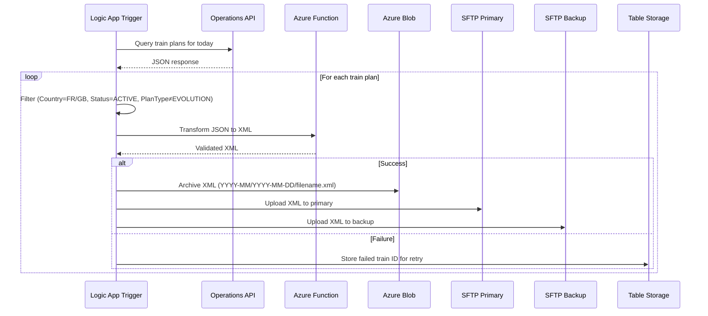
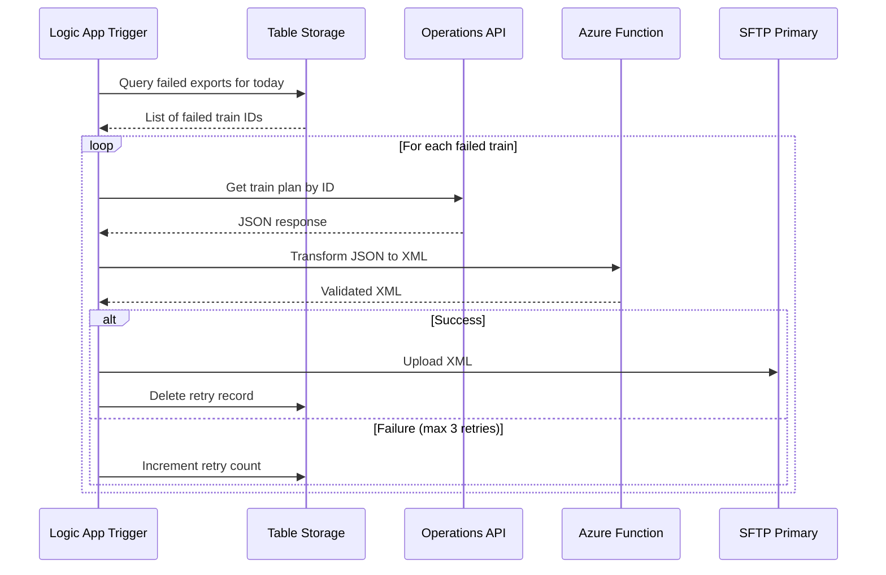
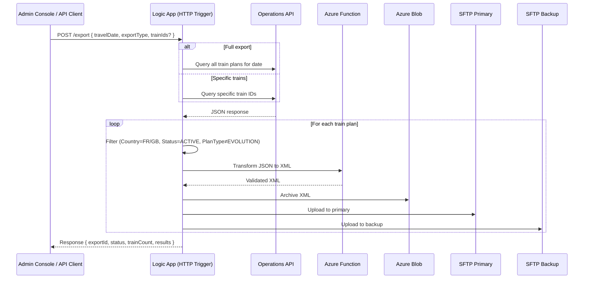

# Use Case 01: RNE Operational Plans Export

## Overview

This document describes the Azure Integration Services implementation for exporting train operational plans to Rail Network Europe (RNE) via scheduled batch jobs with automatic retry for failures.

## Solution Architecture

```
┌─────────────────────────────────────────────────────────────────────────────────────┐
│                           Azure Integration Services                                  │
├─────────────────────────────────────────────────────────────────────────────────────┤
│                                                                                       │
│  ┌──────────────────┐     ┌──────────────────┐     ┌──────────────────┐             │
│  │  Logic App       │     │  Logic App       │     │  Logic App       │             │
│  │  Daily Export    │     │  D+2 Export      │     │  Retry Failed    │             │
│  │  (Cron 6:00 AM)  │     │  (Cron 6:30 AM)  │     │  (Cron 7:00 AM)  │             │
│  └────────┬─────────┘     └────────┬─────────┘     └────────┬─────────┘             │
│           │                        │                        │                        │
│           └────────────────────────┼────────────────────────┘                        │
│                                    ▼                                                 │
│                    ┌───────────────────────────────┐                                 │
│                    │     Azure Function            │                                 │
│                    │     TransformTrainPlan        │                                 │
│                    │     - GraphQL Client          │                                 │
│                    │     - JSON → XML Transform    │                                 │
│                    │     - XSD Validation          │                                 │
│                    └───────────────┬───────────────┘                                 │
│                                    │                                                 │
│           ┌────────────────────────┼────────────────────────┐                        │
│           ▼                        ▼                        ▼                        │
│  ┌─────────────────┐     ┌─────────────────┐     ┌─────────────────┐                │
│  │  Azure Blob     │     │  SFTP Server    │     │  SFTP Server    │                │
│  │  Storage        │     │  (Primary)      │     │  (Backup)       │                │
│  │  ci-rne-export  │     │  Container Apps │     │  Container Apps │                │
│  └─────────────────┘     └─────────────────┘     └─────────────────┘                │
│                                                                                       │
│                    ┌───────────────────────────────┐                                 │
│                    │     Azure Table Storage       │                                 │
│                    │     Failed Exports State      │                                 │
│                    └───────────────────────────────┘                                 │
│                                                                                       │
└─────────────────────────────────────────────────────────────────────────────────────┘

                                    ▲
                                    │
                    ┌───────────────────────────────┐
                    │     Operations GraphQL API    │
                    │     (Internal Source System)  │
                    └───────────────────────────────┘
```

## Azure Services Used

| Service | Purpose | SKU/Plan |
|---------|---------|----------|
| **Logic Apps Standard** | Workflow orchestration with cron scheduling | Workflow Standard WS1 |
| **Azure Functions** | GraphQL client, JSON→XML transformation, XSD validation | Flex Consumption |
| **Azure Blob Storage** | Archive exported XML files | Standard LRS |
| **Azure Table Storage** | Store failed export state for retry pattern | Standard LRS |
| **Azure Container Apps** | Host SFTP servers (primary & backup) | Consumption |
| **Azure Files** | Persistent storage for SFTP data and SSH keys | Standard LRS |
| **Application Insights** | Monitoring and diagnostics | Pay-as-you-go |

## Workflow Specifications

### 1. Daily Export Workflow (`rne-daily-export`)

**Trigger:** Recurrence - Daily at 06:00 AM (Europe/Paris timezone)

**Flow:**


**Actions:**
1. **Recurrence Trigger** - Cron: `0 0 6 * * *` (Europe/Paris)
2. **HTTP Action** - POST to GraphQL API with travel date query
3. **Parse JSON** - Extract train plans array
4. **Filter Array** - Apply business rules:
   - `country` IN ['FR', 'GB']
   - `status` = 'ACTIVE'
   - `planType` != 'EVOLUTION'
5. **For Each** - Process each filtered plan:
   - **Azure Function** - Call `TransformTrainPlan` function
   - **Create Blob** - Archive to `ci-rne-export/YYYY-MM/YYYY-MM-DD/{serviceCode}_{travelDate}.xml`
   - **SFTP Upload (Primary)** - Upload to primary RNE server
   - **SFTP Upload (Backup)** - Upload to backup RNE server
6. **Scope (Catch)** - On failure:
   - **Insert Entity** - Add failed train ID to Table Storage

### 2. D+2 Export Workflow (`rne-d2-export`)

**Trigger:** Recurrence - Daily at 06:30 AM (Europe/Paris timezone)

**Flow:** Same as Daily Export, but queries for `travelDate = today + 2 days`

**Purpose:** Export future train plans to give RNE advance notice of scheduled services.

### 3. Retry Failed Exports Workflow (`rne-retry-failed`)

**Trigger:** Recurrence - Daily at 07:00 AM (Europe/Paris timezone)

**Flow:**


### 4. HTTP Trigger Workflow (`rne-http-trigger`)

**Trigger:** HTTP POST Request

**Purpose:** On-demand export capability for manual triggering, reprocessing specific trains, or integration with external systems.

**Endpoint:** `https://<logic-app-name>.azurewebsites.net/api/rne-http-trigger/triggers/Manual_HTTP_Trigger/invoke?api-version=2022-05-01&sp=%2Ftriggers%2FManual_HTTP_Trigger%2Frun&sv=1.0&sig=<SAS-signature>`

**Flow:**


**Request Schema:**
```json
{
  "travelDate": "2026-01-16",     // Required: Date to export (YYYY-MM-DD)
  "exportType": "full",            // Required: "full" or "partial"
  "trainIds": ["TRN001", "TRN002"] // Optional: Specific trains (for partial export)
}
```

**Response Schema:**
```json
{
  "exportId": "exp-20260116-001",
  "status": "completed",
  "trainCount": 15,
  "processedAt": "2026-01-16T10:30:00Z",
  "results": [
    { "trainId": "TRN001", "status": "success", "filename": "ES9001_2026-01-16.xml" },
    { "trainId": "TRN002", "status": "success", "filename": "ES9002_2026-01-16.xml" }
  ]
}
```

**Authentication:** SAS Token (included in callback URL)  
**Authorization Level:** Anonymous (protected by SAS signature)

**Use Cases:**
- **Ad-hoc Export:** Export train plans outside the scheduled window
- **Reprocessing:** Re-export specific trains after corrections
- **Testing:** Validate workflow before going live
- **Integration:** Trigger from external systems or admin console

## Azure Function Specification

### TransformTrainPlan Function

**Runtime:** .NET 8 Isolated  
**Trigger:** HTTP (POST)  
**Input:** JSON train plan object  
**Output:** XML string (TAF-JSG PassengerTrainCompositionProcessMessage v2.1.6)

```csharp
[Function("TransformTrainPlan")]
public async Task<IActionResult> Run(
    [HttpTrigger(AuthorizationLevel.Function, "post")] HttpRequest req)
{
    // 1. Parse input JSON
    var trainPlan = await req.ReadFromJsonAsync<TrainPlan>();
    
    // 2. Load reference data (location codes, weights, vehicle numbers)
    var referenceData = await _referenceDataService.GetReferenceDataAsync();
    
    // 3. Transform to XML
    var xml = _xmlTransformer.Transform(trainPlan, referenceData);
    
    // 4. Validate against XSD schema
    var isValid = _xmlValidator.Validate(xml, "PassengerTrainCompositionProcessMessage_v2.1.6.xsd");
    
    if (!isValid)
        return new BadRequestObjectResult("XML validation failed");
    
    return new OkObjectResult(xml);
}
```

### GraphQL Query Structure

```graphql
query GetTrainPlans($travelDate: Date!) {
  trainPlans(filter: { travelDate: $travelDate }) {
    id
    serviceCode
    pathway
    travelDate
    passagePoints {
      locationCode
      arrivalTime
      departureTime
    }
    origin
    destination
    status
    planType
    country
  }
}
```

## SFTP Server Configuration

### Azure Container Apps Deployment

The SFTP servers are deployed using the `atmoz/sftp:alpine` Docker image on Azure Container Apps with:

- **TCP Ingress** on port 22 (external)
- **Azure Files** mount for persistent storage
- **SSH Key Persistence** via `/etc/sftp.d/copykeys.sh` script
- **IP Restrictions** for security

### Architecture

```
┌─────────────────────────────────────────────────────────────────┐
│                 Azure Container Apps Environment                 │
├─────────────────────────────────────────────────────────────────┤
│  ┌─────────────────────┐     ┌─────────────────────┐           │
│  │  SFTP Primary       │     │  SFTP Backup        │           │
│  │  sftp-rne-primary   │     │  sftp-rne-backup    │           │
│  │  atmoz/sftp:alpine  │     │  atmoz/sftp:alpine  │           │
│  │  Port: 22 (TCP)     │     │  Port: 22 (TCP)     │           │
│  └──────────┬──────────┘     └──────────┬──────────┘           │
│             │                           │                       │
│  ┌──────────┴───────────────────────────┴──────────┐           │
│  │              Azure Files Storage                 │           │
│  │  ┌───────────┐ ┌───────────┐ ┌───────────┐      │           │
│  │  │ sftpdata  │ │ sshkeys   │ │ scripts   │      │           │
│  │  │ (r/w)     │ │ (r/o)     │ │ (r/o)     │      │           │
│  │  └───────────┘ └───────────┘ └───────────┘      │           │
│  └──────────────────────────────────────────────────┘           │
│                                                                  │
│  IP Restrictions: Allow only Logic Apps outbound IPs            │
└─────────────────────────────────────────────────────────────────┘
```

### Volume Mounts

| File Share | Mount Path | Access | Purpose |
|------------|------------|--------|---------|
| `sftpdata` | `/home/<user>/upload` | Read-Write | SFTP file storage |
| `sshkeys` | `/etc/sftpkeys` | Read-Only | Persistent SSH host keys |
| `scripts` | `/etc/sftp.d` | Read-Only | Startup scripts (copykeys.sh) |

## Blob Storage Structure

```
ci-rne-export/
├── 2026-01/
│   ├── 2026-01-16/
│   │   ├── ES9001_2026-01-16.xml
│   │   ├── ES9002_2026-01-16.xml
│   │   └── ES9003_2026-01-16.xml
│   └── 2026-01-17/
│       └── ...
└── 2026-02/
    └── ...
```

## Table Storage Schema (Failed Exports)

**Table Name:** `FailedExports`

| PartitionKey | RowKey | TrainId | TravelDate | FailureReason | RetryCount | CreatedAt |
|--------------|--------|---------|------------|---------------|------------|-----------|
| 2026-01-16 | {guid} | ES9001 | 2026-01-16 | SFTP timeout | 1 | 2026-01-16T06:15:00Z |

## Deployment

### Prerequisites

- Azure CLI installed and logged in
- Bicep CLI installed
- PowerShell 7+ or Bash

### Quick Start

```powershell
# PowerShell
cd infra
.\deploy.ps1 -ResourceGroupName "rg-transgrid-demo" -Location "westeurope" -Environment "dev"
```

```bash
# Bash
cd infra
./deploy.sh --resource-group "rg-transgrid-demo" --location "westeurope" --environment "dev"
```

### Post-Deployment Steps

1. **Generate SSH Host Keys** (first time only):
   ```bash
   ssh-keygen -t ed25519 -f ssh_host_ed25519_key -N ''
   ssh-keygen -t rsa -b 4096 -f ssh_host_rsa_key -N ''
   ```

2. **Upload SSH Keys to Azure Files** (sshkeys share):
   - `ssh_host_ed25519_key`
   - `ssh_host_ed25519_key.pub`
   - `ssh_host_rsa_key`
   - `ssh_host_rsa_key.pub`

3. **Upload copykeys.sh to Azure Files** (scripts share)

4. **Configure Logic Apps Connections**:
   - Azure Blob Storage connection
   - SFTP connection (primary server)
   - SFTP connection (backup server)
   - Azure Table Storage connection

5. **Deploy Workflow Definitions**:
   - Import `rne-daily-export.json`
   - Import `rne-d2-export.json`
   - Import `rne-retry-failed.json`

## Demo Walkthrough

### Step 1: Review Mock Server Data

1. Navigate to the mock server: `http://localhost:5000`
2. Go to **Ops API** page to view train plans
3. Note the train plans with various statuses (ACTIVE, CANCELLED, DELAYED)

### Step 2: Trigger GraphQL Query

1. Open **RNE Export** page in mock server
2. Click **Simulate Export** button
3. Observe filtering:
   - Only FR/GB countries
   - Only ACTIVE status
   - Excludes EVOLUTION plan types

### Step 3: View Transformation Output

1. Click on a train plan to see JSON source
2. View the transformed XML output
3. Verify XML structure matches TAF-JSG schema

### Step 4: Monitor Logic App Execution

1. Open Azure Portal → Logic Apps
2. Navigate to **rne-daily-export** workflow
3. View run history and execution details
4. Examine each action's inputs/outputs

### Step 5: Verify SFTP Upload

1. Connect to SFTP server using FileZilla:
   - Host: `<container-app-fqdn>`
   - Port: 22
   - Protocol: SFTP
   - Username/Password: (from deployment)
2. Navigate to `/upload` folder
3. Verify XML files are present

### Step 6: Test Retry Pattern

1. In mock server, simulate a failure for one train
2. Wait for retry workflow to execute
3. Verify the failed train is reprocessed
4. Check Table Storage for retry records

## Monitoring & Alerting

### Application Insights Queries

**Failed Exports by Day:**
```kusto
customEvents
| where name == "RneExportFailed"
| summarize FailedCount = count() by bin(timestamp, 1d)
| render timechart
```

**Export Duration:**
```kusto
requests
| where name == "TransformTrainPlan"
| summarize avg(duration), percentile(duration, 95) by bin(timestamp, 1h)
```

### Recommended Alerts

| Alert | Condition | Severity |
|-------|-----------|----------|
| Export Failure Rate | Failed exports > 10% | Warning |
| SFTP Connection Failure | SFTP upload fails 3x | Critical |
| Long Running Export | Duration > 30 minutes | Warning |
| Retry Queue Growing | Failed count > 50 | Critical |

## Security Considerations

1. **SFTP Access Control**
   - IP restrictions on Container Apps ingress
   - Strong passwords or SSH key authentication
   - Separate credentials for primary/backup servers

2. **Secrets Management**
   - SFTP credentials stored in Logic Apps connections
   - Function keys for HTTP triggers
   - Storage account keys in Key Vault (recommended)

3. **Network Isolation**
   - VNet integration for Container Apps
   - Private endpoints for storage (optional)
   - NSG rules for SFTP ports

## Cost Estimation (Monthly)

| Service | Configuration | Estimated Cost |
|---------|--------------|----------------|
| Logic Apps Standard | WS1, ~1000 runs/day | ~$150 |
| Azure Functions | Flex Consumption, ~3000 executions/day | ~$5 |
| Azure Blob Storage | 10 GB, LRS | ~$2 |
| Azure Table Storage | 1 GB, 10K transactions/day | ~$1 |
| Container Apps (x2) | Consumption, 0.5 vCPU, 1 GB | ~$40 |
| Azure Files (x2) | 10 GB each, Standard | ~$10 |
| **Total** | | **~$208/month** |

## References

- [TAF-JSG Technical Specification](https://www.era.europa.eu/domains/registers/taf-tsi_en)
- [Azure Logic Apps Documentation](https://learn.microsoft.com/azure/logic-apps/)
- [Azure Functions Documentation](https://learn.microsoft.com/azure/azure-functions/)
- [Azure Container Apps TCP Ingress](https://learn.microsoft.com/azure/container-apps/ingress-overview#tcp)
- [atmoz/sftp Docker Image](https://github.com/atmoz/sftp)
