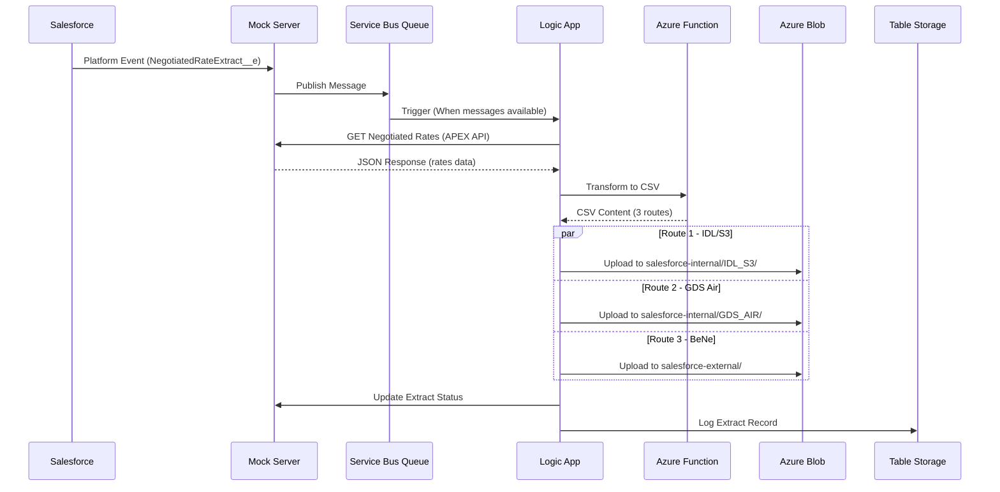
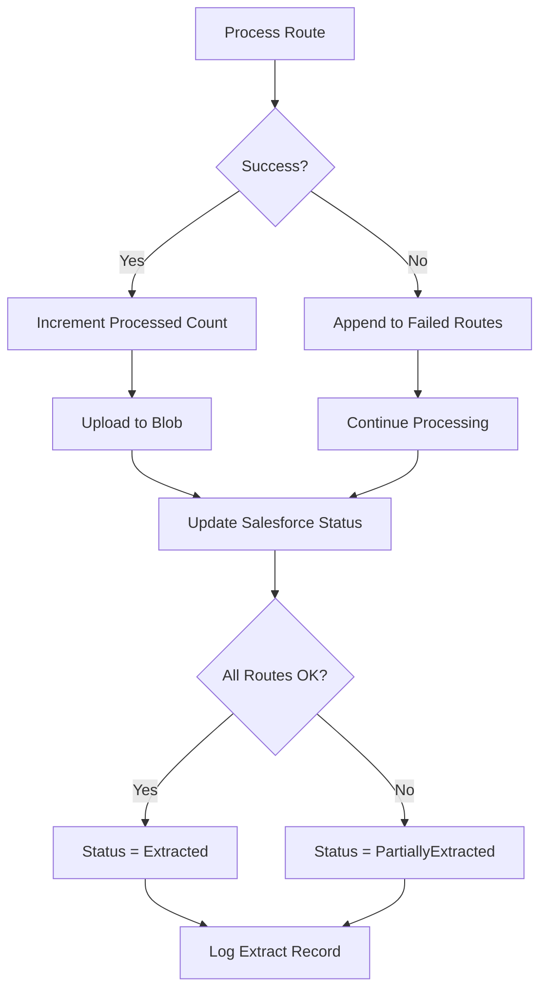

# Use Case 02: Salesforce Negotiated Rates Export

## Overview

This document describes the Azure Integration Services implementation for exporting negotiated rates from Salesforce to distribution systems via an event-driven architecture using Azure Service Bus.

## Solution Architecture

```
┌─────────────────────────────────────────────────────────────────────────────────────┐
│                           Azure Integration Services                                  │
├─────────────────────────────────────────────────────────────────────────────────────┤
│                                                                                       │
│  ┌──────────────────┐     ┌──────────────────┐     ┌──────────────────┐             │
│  │  Salesforce      │     │  Azure Service   │     │  Logic App       │             │
│  │  Platform Event  │────▶│  Bus Queue       │────▶│  sf-negotiated-  │             │
│  │  Trigger         │     │  (salesforce-    │     │  rates           │             │
│  │                  │     │  negotiated-     │     │  (Standard)      │             │
│  └──────────────────┘     │  rates)          │     └────────┬─────────┘             │
│                           └──────────────────┘              │                        │
│                                                              ▼                        │
│                    ┌───────────────────────────────────────────────────┐             │
│                    │                 Processing Pipeline                │             │
│                    ├───────────────────────────────────────────────────┤             │
│                    │  1. Parse Event Data                              │             │
│                    │  2. Get Negotiated Rates from Salesforce API      │             │
│                    │  3. Transform to CSV (Azure Function)             │             │
│                    │  4. Upload to Blob Storage (3 parallel routes)    │             │
│                    │  5. Update Salesforce Status                      │             │
│                    │  6. Log Extract Record                            │             │
│                    └───────────────────────────────────────────────────┘             │
│                                                              │                        │
│           ┌────────────────────────┬─────────────────────────┤                        │
│           ▼                        ▼                         ▼                        │
│  ┌─────────────────┐     ┌─────────────────┐     ┌─────────────────┐                │
│  │  Azure Blob     │     │  Azure Blob     │     │  Azure Table    │                │
│  │  Storage        │     │  Storage        │     │  Storage        │                │
│  │  (Internal)     │     │  (External)     │     │  (Extract Logs) │                │
│  │  - IDL/S3       │     │  - BeNe         │     │                 │                │
│  │  - GDS Air      │     │                 │     │                 │                │
│  └─────────────────┘     └─────────────────┘     └─────────────────┘                │
│                                                                                       │
└─────────────────────────────────────────────────────────────────────────────────────┘

                                    ▲
                                    │
                    ┌───────────────────────────────┐
                    │     Salesforce                │
                    │     - Platform Events         │
                    │     - APEX Web Services       │
                    │     - Negotiated Rate Records │
                    └───────────────────────────────┘
```

## Azure Services Used

| Service | Purpose | SKU/Plan |
|---------|---------|----------|
| **Azure Service Bus** | Event ingestion from Salesforce Platform Events | Standard |
| **Logic Apps Standard** | Workflow orchestration with event-driven trigger | Workflow Standard WS1 |
| **Azure Functions** | CSV transformation with route-based filtering | Flex Consumption |
| **Azure Blob Storage** | Store CSV extracts (internal + external containers) | Standard LRS |
| **Azure Table Storage** | Log extract records for audit trail | Standard LRS |
| **Azure Container Apps** | Host Mock Server (simulates Salesforce API) | Consumption |
| **Application Insights** | Monitoring and diagnostics | Pay-as-you-go |

## Integration Flow

### Event-Driven Architecture



## Workflow Specifications

### sf-negotiated-rates Workflow

**Trigger:** Azure Service Bus Queue (`salesforce-negotiated-rates`)

**Trigger Configuration:**
```json
{
  "type": "ServiceProvider",
  "inputs": {
    "serviceProviderConfiguration": {
      "connectionName": "serviceBus",
      "operationId": "receiveQueueMessages",
      "serviceProviderId": "/serviceProviders/serviceBus"
    },
    "parameters": {
      "queueName": "@appsetting('SERVICEBUS_QUEUE_NAME')",
      "isSessionsEnabled": false
    }
  },
  "splitOn": "@triggerOutputs()?['body']"
}
```

**Actions:**

| Step | Action | Description |
|------|--------|-------------|
| 1 | Initialize_RunId | Generate unique correlation ID |
| 2 | Initialize_ProcessedCount | Counter for processed records |
| 3 | Initialize_FailedRoutes | Array to track failed routes |
| 4 | Parse_Event_Data | Extract negotiated rate IDs from message |
| 5 | Get_Negotiated_Rates_From_API | Call Salesforce APEX web service |
| 6 | Check_API_Response | Validate HTTP 200 response |
| 7 | Transform_Rates_To_CSV | Call Azure Function for transformation |
| 8 | Parse_Transform_Response | Extract route-based CSV data |
| 9 | Process_Each_Route_In_Parallel | Upload CSVs to appropriate containers |
| 10 | Update_Salesforce_Status | Mark records as extracted |
| 11 | Log_Extract_Record | Write audit record to Table Storage |

### Parallel Route Processing

The workflow processes three extract types in parallel:

| Route | Code Record Types | Container | Path Pattern |
|-------|-------------------|-----------|--------------|
| **IDL/S3** | GND BE, GND NL, FCE, Eurostar for Business | salesforce-internal | `IDL_S3/yyyyMM/yyyyMMdd_HHmmss_*.csv` |
| **GDS Air** | Amadeus, Apollo, Galileo, Sabre | salesforce-internal | `GDS_AIR/yyyyMM/yyyyMMdd_HHmmss_*.csv` |
| **BeNe** | GND BE, GND NL (external partners) | salesforce-external | `yyyyMM/yyyyMMdd_HHmmss_*.csv` |

### Error Handling



## Azure Function Specification

### TransformNegotiatedRates Function

**Runtime:** .NET 8 Isolated  
**Trigger:** HTTP (POST)  
**Input:** JSON negotiated rates with route filter  
**Output:** CSV content per route

```csharp
[Function("TransformNegotiatedRates")]
public async Task<IActionResult> Run(
    [HttpTrigger(AuthorizationLevel.Function, "post")] HttpRequest req)
{
    var request = await req.ReadFromJsonAsync<TransformRequest>();
    
    var result = new TransformationResult
    {
        CorrelationId = Guid.NewGuid().ToString(),
        Routes = new List<RouteResult>()
    };
    
    // Process each route type
    foreach (var routeType in GetRouteTypes(request.ExtractRoute))
    {
        var filteredRates = FilterByRoute(request.NegotiatedRates, routeType);
        var csvContent = GenerateCsv(filteredRates, routeType);
        
        result.Routes.Add(new RouteResult
        {
            RouteCode = routeType.Code,
            RouteName = routeType.Name,
            Success = true,
            RecordCount = filteredRates.Count,
            FileName = $"NegotiatedRates_{routeType.Code}_{DateTime.UtcNow:yyyyMMdd_HHmmss}.csv",
            CsvContent = csvContent
        });
    }
    
    return new OkObjectResult(result);
}
```

### Request Schema

```json
{
  "extractRoute": "ALL",
  "priority": "ALL",
  "negotiatedRates": [
    {
      "id": "NR-001",
      "accountManager": "John Smith",
      "accountName": "Acme Corp",
      "uniqueCode": "ACME001",
      "codeRecordType": "GND BE",
      "road": "LON-PAR",
      "tariffCodes": ["STD", "FLEX"],
      "discounts": { "STD": 10, "FLEX": 15 },
      "priority": "Normal",
      "actionType": "CREATE"
    }
  ]
}
```

### Response Schema

```json
{
  "success": true,
  "correlationId": "abc-123-def",
  "totalRecords": 11,
  "successCount": 11,
  "failedCount": 0,
  "routes": [
    {
      "routeName": "IDL/S3 Extract",
      "routeCode": "IDL_S3",
      "success": true,
      "recordCount": 5,
      "fileName": "NegotiatedRates_IDL_S3_20260120_204333.csv",
      "csvContent": "Account Manager,Account Name,..."
    },
    {
      "routeName": "GDS Air Extract",
      "routeCode": "GDS_AIR",
      "success": true,
      "recordCount": 4,
      "fileName": "NegotiatedRates_GDS_AIR_20260120_204333.csv",
      "csvContent": "Account Manager,Account Name,..."
    },
    {
      "routeName": "BeNe Extract",
      "routeCode": "BENE",
      "success": true,
      "recordCount": 2,
      "fileName": "NegotiatedRates_BENE_20260120_204333.csv",
      "csvContent": "Account Manager,Account Name,..."
    }
  ],
  "timestamp": "2026-01-20T20:43:33Z"
}
```

## CSV Output Formats

### Route 1 - IDL/S3 Extract

```csv
Account Manager,Account Name,Unique Code,Type,Road,Tariff Codes,Discounts,Action Type
John Smith,Acme Corp,ACME001,GND BE,LON-PAR,STD|FLEX,10%|15%,CREATE
Jane Doe,TravelCo,TC002,GND NL,PAR-AMS,BUS|PREM,12%|18%,UPDATE
```

**Filter Criteria:**
- Code Record Type IN: `GND BE`, `GND NL`, `FCE`, `Eurostar for Business`

### Route 2 - GDS Air Extract

```csv
Account Manager,Account Name,Unique Code,GDS Used,PCC,Road,Tariff Codes,Dates,Action Type
Bob Wilson,FlightTravel,FT003,Amadeus,LONTP23,LON-BRU,BUS|PREM,2026-01-01|2026-12-31,CREATE
```

**Filter Criteria:**
- Code Record Type IN: `Corporate code Amadeus`, `Apollo`, `Galileo`, `Sabre`

### Route 3 - BeNe Extract

```csv
Account Manager,Account Name,Unique Code,Distributor,Road,Tariff Codes,Action Type
Marie Dupont,EuroTravel,ET004,Thalys,PAR-BRU,ECO|COMF,CREATE
```

**Filter Criteria:**
- Code Record Type IN: `GND BE`, `GND NL`
- For external partners only

## Azure Service Bus Configuration

### Namespace

| Property | Value |
|----------|-------|
| **Name** | `sbns-transgrid-dev` |
| **SKU** | Standard |
| **Location** | West Europe |

### Queue

| Property | Value |
|----------|-------|
| **Name** | `salesforce-negotiated-rates` |
| **Max Delivery Count** | 10 |
| **Message TTL** | 14 days |
| **Dead Lettering** | Enabled |
| **Lock Duration** | 30 seconds |

### Authorization Rules

| Rule | Rights | Purpose |
|------|--------|---------|
| **SendPolicy** | Send | Mock Server publishing |
| **ListenPolicy** | Listen | Logic App trigger |
| **ManagePolicy** | Manage, Send, Listen | Administration |

## Blob Storage Structure

### Internal Container (`salesforce-internal`)

```
salesforce-internal/
├── IDL_S3/
│   └── 202601/
│       ├── 20260120_183117_NegotiatedRates_IDL_S3_20260120_183117.csv
│       ├── 20260120_195037_NegotiatedRates_IDL_S3_20260120_195036.csv
│       └── 20260120_204333_NegotiatedRates_IDL_S3_20260120_204333.csv
├── GDS_AIR/
│   └── 202601/
│       ├── 20260120_183117_NegotiatedRates_GDS_AIR_20260120_183117.csv
│       ├── 20260120_195037_NegotiatedRates_GDS_AIR_20260120_195036.csv
│       └── 20260120_204333_NegotiatedRates_GDS_AIR_20260120_204333.csv
```

### External Container (`salesforce-external`)

```
salesforce-external/
└── 202601/
    ├── 20260120_183117_NegotiatedRates_BENE_20260120_183117.csv
    ├── 20260120_195037_NegotiatedRates_BENE_20260120_195036.csv
    └── 20260120_204333_NegotiatedRates_BENE_20260120_204333.csv
```

## Table Storage Schema (Extract Logs)

**Table Name:** `SalesforceExtracts`

| Column | Type | Description |
|--------|------|-------------|
| PartitionKey | string | Date (yyyy-MM-dd) |
| RowKey | string | RunId (GUID) |
| EventType | string | NegotiatedRateExtract__e |
| TotalRecords | int | Total records processed |
| ProcessedCount | int | Successfully processed |
| FailedRoutesCount | int | Number of failed routes |
| CorrelationId | string | Event correlation ID |
| CompletedAt | datetime | Completion timestamp |

**Example Record:**

| PartitionKey | RowKey | EventType | TotalRecords | ProcessedCount | FailedRoutesCount | CompletedAt |
|--------------|--------|-----------|--------------|----------------|-------------------|-------------|
| 2026-01-20 | abc-123 | NegotiatedRateExtract__e | 11 | 11 | 0 | 2026-01-20T20:43:35Z |

## Deployment

### Prerequisites

- Azure CLI installed and logged in
- Bicep CLI installed
- PowerShell 7+ or Bash
- Docker (for Mock Server)

### Quick Start

```powershell
# Deploy infrastructure (includes Service Bus)
cd infra
.\deploy.ps1 -ResourceGroupName "rg-transgrid-dev" -Location "westeurope" -Environment "dev"

# Deploy Mock Server
cd infra/scripts
.\deploy-mockserver.ps1 -ResourceGroupName rg-transgrid-dev

# Deploy Logic Apps workflows
.\deploy-logicapps.ps1 -ResourceGroupName rg-transgrid-dev

# Deploy Azure Functions
.\deploy-functions.ps1 -ResourceGroupName rg-transgrid-dev
```

### Post-Deployment Configuration

1. **Verify Service Bus Connection**
   ```powershell
   az servicebus namespace show --name sbns-transgrid-dev --resource-group rg-transgrid-dev
   ```

2. **Check Queue Status**
   ```powershell
   az servicebus queue show --name salesforce-negotiated-rates --namespace-name sbns-transgrid-dev --resource-group rg-transgrid-dev
   ```

3. **Verify Logic App Settings**
   ```powershell
   az functionapp config appsettings list --name logic-transgrid-rne-export-dev --resource-group rg-transgrid-dev --query "[?name=='SERVICEBUS_CONNECTION_STRING' || name=='SERVICEBUS_QUEUE_NAME']"
   ```

## Demo Walkthrough

### Step 1: Access Mock Server

1. Navigate to the Mock Server URL:
   ```
   https://ca-transgrid-mock-dev.mangoforest-017b4af1.westeurope.azurecontainerapps.io
   ```
2. Click on **Salesforce** in the navigation menu

### Step 2: Trigger Platform Event

1. On the Salesforce demo page, click **Trigger Platform Event**
2. The UI will show:
   - Message published to Service Bus
   - Correlation ID
   - Record count

### Step 3: Monitor Logic App Execution

1. Open Azure Portal → Logic Apps
2. Navigate to `logic-transgrid-rne-export-dev`
3. Select **sf-negotiated-rates** workflow
4. View run history
5. Click on latest run to see action details:
   - `When_messages_are_available_in_queue` - Service Bus trigger
   - `Get_Negotiated_Rates_From_API` - Salesforce API call
   - `Transform_Rates_To_CSV` - Azure Function transformation
   - `Upload_CSV_To_Blob` - File upload (per route)
   - `Log_Extract_Record` - Audit logging

### Step 4: Verify Blob Storage Output

1. Open Azure Portal → Storage Account
2. Navigate to Containers:
   - `salesforce-internal` → `IDL_S3/202601/`
   - `salesforce-internal` → `GDS_AIR/202601/`
   - `salesforce-external` → `202601/`
3. Download and verify CSV content

### Step 5: Check Table Storage Logs

1. Open Azure Portal → Storage Account → Tables
2. Select `SalesforceExtracts` table
3. Verify extract log entry with:
   - Correct date partition
   - Record counts
   - Completion timestamp

## API Endpoints

### Mock Server (Simulating Salesforce)

| Endpoint | Method | Description |
|----------|--------|-------------|
| `/api/Salesforce/platform-event` | POST | Trigger platform event |
| `/api/Salesforce/getNegotiatedRates` | POST | Get negotiated rate details |
| `/api/Salesforce/updateExtractStatus` | POST | Update extraction status |

### Azure Function

| Endpoint | Method | Description |
|----------|--------|-------------|
| `/api/TransformNegotiatedRates` | POST | Transform rates to CSV |

## Monitoring & Alerting

### Application Insights Queries

**Successful Extracts by Day:**
```kusto
customEvents
| where name == "SalesforceExtractCompleted"
| summarize ExtractCount = count() by bin(timestamp, 1d)
| render timechart
```

**Extract Duration:**
```kusto
requests
| where name == "TransformNegotiatedRates"
| summarize avg(duration), percentile(duration, 95) by bin(timestamp, 1h)
```

**Failed Routes:**
```kusto
traces
| where message contains "Route failed"
| summarize count() by routeCode
```

### Recommended Alerts

| Alert | Condition | Severity |
|-------|-----------|----------|
| Service Bus Queue Depth | Messages > 100 | Warning |
| Workflow Failure | Failed runs > 5 in 1 hour | Critical |
| Transform Function Error | Error rate > 10% | Warning |
| Blob Upload Failure | Upload fails 3x | Critical |

## Security Considerations

1. **Service Bus Security**
   - Shared Access Signatures (SAS) for authentication
   - Separate policies for send/listen/manage
   - Connection strings stored in Logic App settings

2. **API Security**
   - Function keys for Azure Functions
   - HTTPS only endpoints
   - CORS configured for Mock Server

3. **Storage Security**
   - Managed Identity recommended
   - Connection strings in Logic App settings
   - Container-level access policies

4. **Network Isolation (Production)**
   - Private endpoints for Service Bus
   - VNet integration for Logic Apps
   - Private endpoints for Storage

## Cost Estimation (Monthly)

| Service | Configuration | Estimated Cost |
|---------|--------------|----------------|
| Azure Service Bus | Standard, ~1000 messages/day | ~$10 |
| Logic Apps Standard | WS1, ~500 runs/day | ~$150 |
| Azure Functions | Flex Consumption, ~1500 executions/day | ~$3 |
| Azure Blob Storage | 5 GB, LRS | ~$1 |
| Azure Table Storage | 1 GB, 5K transactions/day | ~$1 |
| Container Apps | Consumption, 0.5 vCPU, 1 GB | ~$20 |
| **Total** | | **~$185/month** |

## Test Results Summary

### Validation Run (2026-01-20 20:43:31 UTC)

| Component | Status |
|-----------|--------|
| Service Bus Trigger | ✅ Succeeded |
| Parse Event Data | ✅ Succeeded |
| Get Negotiated Rates From API | ✅ Succeeded |
| Transform Rates To CSV | ✅ Succeeded |
| Upload CSV To Blob (IDL_S3) | ✅ Succeeded |
| Upload CSV To Blob (GDS_AIR) | ✅ Succeeded |
| Upload CSV To Blob (BENE) | ✅ Succeeded |
| Log Extract Record | ✅ Succeeded |
| Update Salesforce Status | ⚠️ BadRequest (non-critical) |

### Files Generated

| Container | File |
|-----------|------|
| salesforce-internal | `GDS_AIR/202601/20260120_204333_NegotiatedRates_GDS_AIR_20260120_204333.csv` |
| salesforce-internal | `IDL_S3/202601/20260120_204333_NegotiatedRates_IDL_S3_20260120_204333.csv` |
| salesforce-external | `202601/20260120_204333_NegotiatedRates_BENE_20260120_204333.csv` |

## References

- [Azure Service Bus Documentation](https://learn.microsoft.com/azure/service-bus-messaging/)
- [Azure Logic Apps Service Bus Connector](https://learn.microsoft.com/azure/connectors/connectors-create-api-servicebus)
- [Azure Functions Documentation](https://learn.microsoft.com/azure/azure-functions/)
- [Salesforce Platform Events](https://developer.salesforce.com/docs/atlas.en-us.platform_events.meta/platform_events/)
- [Azure Blob Storage Documentation](https://learn.microsoft.com/azure/storage/blobs/)
