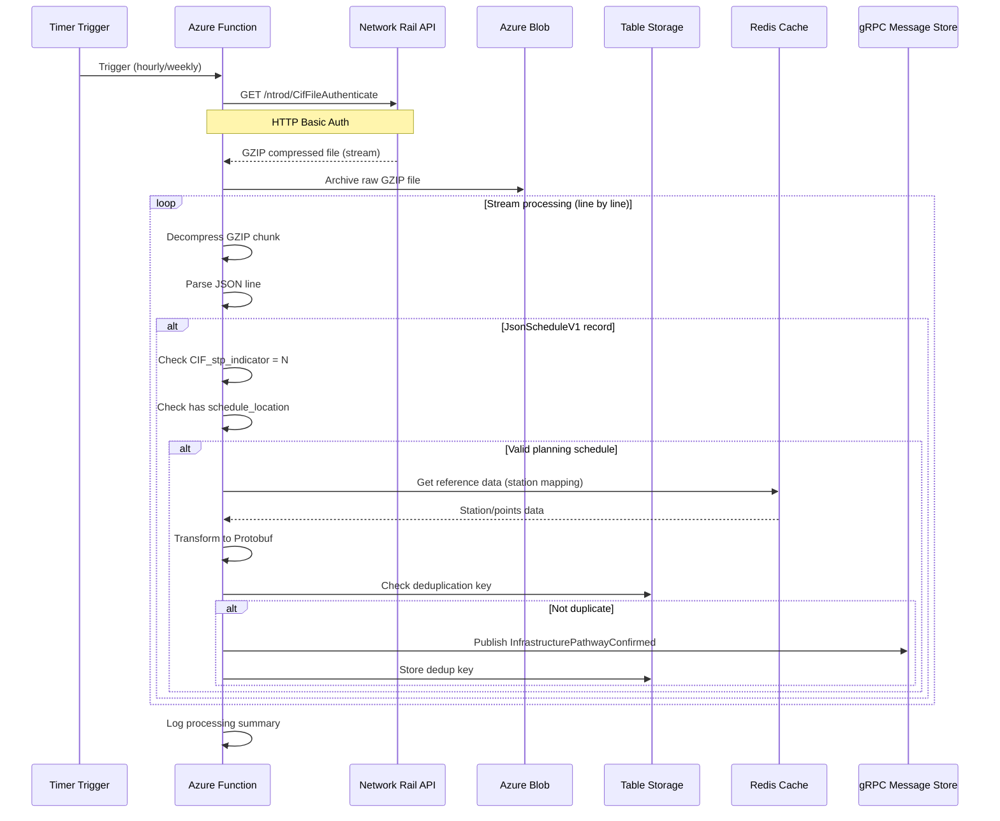
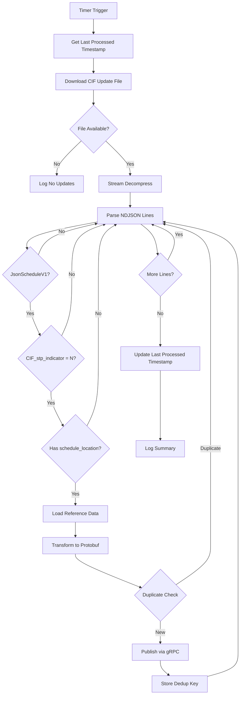

# Use Case 03: Network Rail CIF File Processing

## Overview

This document describes the Azure Integration Services implementation for downloading, processing, and publishing UK rail schedule data from Network Rail's NTROD (Network Rail Train Operator Data) service for journey planning and passenger connections.

## Solution Architecture

```
┌─────────────────────────────────────────────────────────────────────────────────────┐
│                           Azure Integration Services                                  │
├─────────────────────────────────────────────────────────────────────────────────────┤
│                                                                                       │
│  ┌──────────────────┐     ┌──────────────────┐                                       │
│  │  Azure Function  │     │  Azure Function  │                                       │
│  │  Daily Poller    │     │  Weekly Full     │                                       │
│  │  (Timer: hourly) │     │  (Timer: weekly) │                                       │
│  └────────┬─────────┘     └────────┬─────────┘                                       │
│           │                        │                                                 │
│           └────────────────────────┼────────────────────────────────────────┐        │
│                                    ▼                                        │        │
│                    ┌───────────────────────────────┐                        │        │
│                    │     Processing Pipeline       │                        │        │
│                    ├───────────────────────────────┤                        │        │
│                    │  1. Download GZIP file        │                        │        │
│                    │  2. Stream decompress         │                        │        │
│                    │  3. Parse NDJSON line-by-line │                        │        │
│                    │  4. Filter JsonScheduleV1     │                        │        │
│                    │  5. Transform to Protobuf     │                        │        │
│                    │  6. Publish via gRPC          │                        │        │
│                    └───────────────┬───────────────┘                        │        │
│                                    │                                        │        │
│           ┌────────────────────────┼────────────────────────┐               │        │
│           ▼                        ▼                        ▼               │        │
│  ┌─────────────────┐     ┌─────────────────┐     ┌─────────────────┐       │        │
│  │  Azure Blob     │     │  Azure Table    │     │  Internal       │       │        │
│  │  Storage        │     │  Storage        │     │  Message Store  │       │        │
│  │  (Archive)      │     │  (Dedup State)  │     │  (gRPC)         │       │        │
│  └─────────────────┘     └─────────────────┘     └─────────────────┘       │        │
│                                                                              │        │
│                    ┌───────────────────────────────┐                        │        │
│                    │     Azure Cache for Redis     │                        │        │
│                    │     (Reference Data Cache)    │                        │        │
│                    └───────────────────────────────┘                        │        │
│                                                                              │        │
└──────────────────────────────────────────────────────────────────────────────────────┘

                                    ▲
                                    │
                    ┌───────────────────────────────┐
                    │     Network Rail NTROD API    │
                    │     (External Source System)  │
                    │     - CIF Schedule Files      │
                    │     - GZIP Compressed         │
                    │     - HTTP Basic Auth         │
                    └───────────────────────────────┘
```

## Azure Services Used

| Service | Purpose | SKU/Plan |
|---------|---------|----------|
| **Azure Functions** | Timer-triggered file processing with streaming | Flex Consumption |
| **Azure Blob Storage** | Archive downloaded CIF files | Standard LRS |
| **Azure Table Storage** | Store deduplication state for events | Standard LRS |
| **Azure Cache for Redis** | Cache station/points reference data | Basic C0 |
| **Application Insights** | Monitoring and diagnostics | Pay-as-you-go |
| **Azure Key Vault** | Store Network Rail credentials | Standard |

## Integration Flow

### Scheduled File Processing



## Function Specifications

### 1. CIF Daily Poller Function (`ProcessCifUpdates`)

**Trigger:** Timer - Every 60 minutes  
**Cron Expression:** `0 0 * * * *`

**Purpose:** Download and process incremental CIF update files to capture schedule changes.

**Flow:**


### 2. CIF Weekly Full Download Function (`ProcessCifFullRefresh`)

**Trigger:** Timer - Weekly (Sunday 02:00 AM UTC)  
**Cron Expression:** `0 0 2 * * 0`

**Purpose:** Download complete CIF timetable file for full schedule refresh.

**Flow:** Same as daily poller but:
- Downloads full timetable file instead of updates
- Clears deduplication table before processing
- Publishes all valid schedules (full refresh)

### 3. HTTP Trigger Function (`ProcessCifOnDemand`)

**Trigger:** HTTP POST Request

**Purpose:** On-demand CIF processing for testing, reprocessing, or integration with admin console.

**Request Schema:**
```json
{
  "fileType": "update",           // "update" or "full"
  "forceRefresh": false,          // Ignore deduplication if true
  "dateRange": {                  // Optional filter
    "start": "2026-01-15",
    "end": "2026-01-22"
  }
}
```

**Response Schema:**
```json
{
  "processId": "cif-20260122-001",
  "status": "completed",
  "statistics": {
    "totalLines": 1250000,
    "schedulesProcessed": 85000,
    "schedulesFiltered": 165000,
    "eventsPublished": 82500,
    "duplicatesSkipped": 2500,
    "processingTimeMs": 45000
  }
}
```

## Azure Function Implementation

### ProcessCifUpdates Function

**Runtime:** .NET 8 Isolated  
**Trigger:** Timer  
**Memory:** 1024 MB (to handle streaming)

```csharp
[Function("ProcessCifUpdates")]
public async Task Run(
    [TimerTrigger("0 0 * * * *")] TimerInfo timer,
    FunctionContext context)
{
    var logger = context.GetLogger("ProcessCifUpdates");
    var runId = Guid.NewGuid().ToString();
    
    logger.LogInformation("CIF Update processing started. RunId: {RunId}", runId);
    
    // 1. Download GZIP file as stream (avoid loading into memory)
    using var gzipStream = await _networkRailClient.DownloadCifFileAsync();
    
    // 2. Archive raw file to blob storage
    await _blobService.ArchiveCifFileAsync(gzipStream, $"cif-updates/{DateTime.UtcNow:yyyy-MM-dd}/update_{DateTime.UtcNow:HHmmss}.gz");
    
    // 3. Reset stream position and process
    gzipStream.Position = 0;
    var stats = await ProcessCifStreamAsync(gzipStream, runId);
    
    logger.LogInformation("CIF Update completed. Schedules: {Count}, Events: {Events}", 
        stats.SchedulesProcessed, stats.EventsPublished);
}
```

### Streaming Processing Implementation

```csharp
public async Task<ProcessingStatistics> ProcessCifStreamAsync(Stream gzipStream, string runId)
{
    var stats = new ProcessingStatistics();
    
    // Stream decompression - memory efficient
    using var decompressor = new GZipStream(gzipStream, CompressionMode.Decompress);
    using var reader = new StreamReader(decompressor);
    
    string? line;
    while ((line = await reader.ReadLineAsync()) != null)
    {
        stats.TotalLines++;
        
        try
        {
            var record = JsonSerializer.Deserialize<CifRecord>(line);
            
            // Skip non-schedule records
            if (record?.JsonScheduleV1 == null)
                continue;
            
            var schedule = record.JsonScheduleV1;
            
            // Filter: Only planning schedules (N = New, not overlays)
            if (schedule.CIF_stp_indicator != "N")
            {
                stats.SchedulesFiltered++;
                continue;
            }
            
            // Filter: Must have location data
            if (schedule.schedule_location == null || !schedule.schedule_location.Any())
            {
                stats.SchedulesFiltered++;
                continue;
            }
            
            stats.SchedulesProcessed++;
            
            // Load reference data from Redis cache
            var referenceData = await _referenceDataService.GetStationMappingAsync();
            
            // Transform to Protobuf event
            var protoEvent = TransformToProtobuf(schedule, referenceData, runId);
            
            // Deduplication check
            var dedupKey = $"{schedule.CIF_train_uid}_{schedule.schedule_start_date}";
            if (await _deduplicationService.ExistsAsync(dedupKey))
            {
                stats.DuplicatesSkipped++;
                continue;
            }
            
            // Publish via gRPC
            await _messageStoreClient.PublishAsync(protoEvent);
            
            // Store dedup key
            await _deduplicationService.SetAsync(dedupKey, DateTime.UtcNow);
            
            stats.EventsPublished++;
        }
        catch (JsonException ex)
        {
            _logger.LogWarning("Failed to parse CIF line: {Error}", ex.Message);
            stats.ParseErrors++;
        }
    }
    
    return stats;
}
```

### Protobuf Transformation

```csharp
private InfrastructurePathwayConfirmed TransformToProtobuf(
    JsonScheduleV1 schedule, 
    Dictionary<string, StationInfo> referenceData,
    string runId)
{
    var passagePoints = schedule.schedule_location
        .Where(loc => referenceData.ContainsKey(loc.tiploc_code))
        .Select(loc => new PassagePoint
        {
            LocationCode = referenceData[loc.tiploc_code].StationCode,
            LocationName = referenceData[loc.tiploc_code].StationName,
            ArrivalTime = ParseTime(loc.arrival),
            DepartureTime = ParseTime(loc.departure),
            Platform = loc.platform ?? ""
        })
        .ToList();
    
    return new InfrastructurePathwayConfirmed
    {
        TrainServiceNumber = schedule.CIF_train_uid,
        TravelDate = schedule.schedule_start_date,
        Origin = passagePoints.First().LocationCode,
        Destination = passagePoints.Last().LocationCode,
        PassagePoints = { passagePoints },
        Metadata = new EventMetadata
        {
            Domain = "planning.short_term",
            Name = "InfrastructurePathwayConfirmed",
            CorrelationId = runId
        }
    };
}
```

## CIF File Format

### Source File Structure

Network Rail provides CIF files as GZIP-compressed archives containing newline-delimited JSON (NDJSON).

**File Types:**
| Type | Update Frequency | Size (Compressed) | Size (Uncompressed) |
|------|-----------------|-------------------|---------------------|
| Full Timetable | Weekly | ~50 MB | ~500 MB |
| Daily Updates | Hourly | ~1-5 MB | ~10-50 MB |

### NDJSON Record Types

```json
// Header record
{"JsonTimetableV1":{"classification":"public","timestamp":1737532800,"owner":"Network Rail","Sender":{"organisation":"NTROD","application":"NetworkRailTimetable","component":"SCHEDULE"}}}

// Schedule record (JsonScheduleV1)
{"JsonScheduleV1":{"CIF_bank_holiday_running":null,"CIF_stp_indicator":"N","CIF_train_uid":"W12345","applicable_timetable":"Y","atoc_code":"VT","schedule_start_date":"2026-01-22","schedule_end_date":"2026-12-31","schedule_days_runs":"1111100","schedule_location":[{"location_type":"LO","record_identity":"LO","tiploc_code":"EUSTON","departure":"0700","public_departure":"0700","platform":"8"},{"location_type":"LI","record_identity":"LI","tiploc_code":"MKTNKYL","arrival":"0745","departure":"0747","public_arrival":"0745","public_departure":"0747","platform":"2"},{"location_type":"LT","record_identity":"LT","tiploc_code":"MNCRPIC","arrival":"0920","public_arrival":"0920","platform":"1"}],"train_uid":"W12345","train_status":"P","train_category":"XX"}}

// Association record
{"JsonAssociationV1":{"main_train_uid":"W12345","assoc_train_uid":"W67890","assoc_start_date":"2026-01-22","assoc_end_date":"2026-12-31","assoc_days":"1111100","category":"JJ","date_indicator":"S","location":"MKTNKYL","base_location_suffix":null,"assoc_location_suffix":null,"diagram_type":"T"}}
```

### Schedule Record Schema

| Field | Type | Description |
|-------|------|-------------|
| CIF_train_uid | string | Unique train identifier |
| CIF_stp_indicator | string | Schedule type: N=New, P=Permanent, O=Overlay, C=Cancel |
| schedule_start_date | string | Start date (YYYY-MM-DD) |
| schedule_end_date | string | End date (YYYY-MM-DD) |
| schedule_days_runs | string | 7-char binary (Mon-Sun) |
| schedule_location | array | Array of location records |
| atoc_code | string | Train operating company |
| train_status | string | Train status code |
| train_category | string | Train category code |

### Location Record Schema

| Field | Type | Description |
|-------|------|-------------|
| tiploc_code | string | Timing Point Location code |
| location_type | string | LO=Origin, LI=Intermediate, LT=Terminating |
| arrival | string | Arrival time (HHMM or HHMM½) |
| departure | string | Departure time (HHMM or HHMM½) |
| platform | string | Platform number |
| public_arrival | string | Public timetable arrival |
| public_departure | string | Public timetable departure |

## Filtering Rules

### Schedule Filtering Criteria

| Field | Condition | Reason |
|-------|-----------|--------|
| CIF_stp_indicator | = 'N' | Only new/planning schedules (not overlays or cancellations) |
| schedule_location | Must exist and not empty | Schedule must have valid location data |
| JsonScheduleV1 | Record type | Only process schedule records |
| schedule_days_runs | Contains at least one '1' | Schedule runs on at least one day |

### Location Filtering Criteria

| Field | Condition | Reason |
|-------|-----------|--------|
| tiploc_code | Must exist in reference data | Only include mapped stations |
| arrival/departure | At least one must be present | Must have timing data |

## Event Schema (Protobuf)

### InfrastructurePathwayConfirmed

```protobuf
syntax = "proto3";

package planning;

message InfrastructurePathwayConfirmed {
    string train_service_number = 1;   // CIF_train_uid
    string travel_date = 2;            // schedule_start_date
    string origin = 3;                 // First location code
    string destination = 4;            // Last location code
    repeated PassagePoint passage_points = 5;
    EventMetadata metadata = 6;
}

message PassagePoint {
    string location_code = 1;          // Station code (CRS)
    string location_name = 2;          // Station name
    string arrival_time = 3;           // HH:MM format
    string departure_time = 4;         // HH:MM format
    string platform = 5;               // Platform number
}

message EventMetadata {
    string domain = 1;                 // "planning.short_term"
    string name = 2;                   // "InfrastructurePathwayConfirmed"
    string correlation_id = 3;         // Processing run ID
    string timestamp = 4;              // ISO 8601 timestamp
}
```

### Message Tags

| Tag | Value | Purpose |
|-----|-------|---------|
| TrainServiceNumber | CIF_train_uid | Routing and filtering |
| TravelDate | schedule_start_date | Routing and filtering |
| Domain | planning.short_term | Event categorization |
| EventType | InfrastructurePathwayConfirmed | Event identification |

## Memory Management Strategy

### Problem

CIF files can be very large (50+ MB compressed, 500+ MB uncompressed), which can cause memory issues when loading the entire file into memory.

### Solution: Streaming Processing

```csharp
public class StreamingCifProcessor
{
    private const int BufferSize = 8192; // 8 KB buffer
    
    public async IAsyncEnumerable<CifRecord> StreamRecordsAsync(Stream gzipStream)
    {
        // Use streaming decompression - never loads full file into memory
        await using var decompressor = new GZipStream(gzipStream, CompressionMode.Decompress);
        using var reader = new StreamReader(decompressor, Encoding.UTF8, bufferSize: BufferSize);
        
        string? line;
        while ((line = await reader.ReadLineAsync()) != null)
        {
            if (string.IsNullOrWhiteSpace(line))
                continue;
                
            CifRecord? record = null;
            try
            {
                record = JsonSerializer.Deserialize<CifRecord>(line, _jsonOptions);
            }
            catch (JsonException)
            {
                // Skip malformed lines
                continue;
            }
            
            if (record != null)
                yield return record;
        }
    }
}
```

### Memory Optimization Techniques

| Technique | Implementation | Benefit |
|-----------|----------------|---------|
| Streaming Decompression | `GZipStream` with `CompressionMode.Decompress` | Never loads compressed file into memory |
| Line-by-Line Reading | `StreamReader.ReadLineAsync()` | Processes one record at a time |
| Small Buffer Size | 8 KB buffer for reader | Limits memory footprint |
| Async Enumerable | `IAsyncEnumerable<T>` | Enables backpressure and lazy evaluation |
| Early Filtering | Filter before transformation | Reduces objects created |
| Object Pooling | Reuse DTO objects where possible | Reduces GC pressure |

## Deduplication Strategy

### Purpose

Prevent publishing duplicate events when:
- Same schedule is received in multiple update files
- Weekly full refresh overlaps with daily updates
- Retry processing after failures

### Implementation

```csharp
public class DeduplicationService
{
    private readonly TableClient _tableClient;
    private const string TableName = "CifDeduplication";
    
    public async Task<bool> ExistsAsync(string dedupKey)
    {
        try
        {
            var partitionKey = dedupKey.Substring(0, 8); // First 8 chars
            var rowKey = dedupKey;
            
            var response = await _tableClient.GetEntityIfExistsAsync<TableEntity>(
                partitionKey, rowKey);
                
            return response.HasValue;
        }
        catch (RequestFailedException)
        {
            return false;
        }
    }
    
    public async Task SetAsync(string dedupKey, DateTime processedAt)
    {
        var entity = new TableEntity(
            partitionKey: dedupKey.Substring(0, 8),
            rowKey: dedupKey)
        {
            { "ProcessedAt", processedAt },
            { "TTL", processedAt.AddDays(30) } // Auto-cleanup after 30 days
        };
        
        await _tableClient.UpsertEntityAsync(entity);
    }
}
```

### Deduplication Key Format

```
{CIF_train_uid}_{schedule_start_date}
```

Example: `W12345_2026-01-22`

## Table Storage Schema

### CIF Deduplication Table

**Table Name:** `CifDeduplication`

| Column | Type | Description |
|--------|------|-------------|
| PartitionKey | string | First 8 characters of dedup key |
| RowKey | string | Full dedup key |
| ProcessedAt | datetime | When the record was processed |
| TTL | datetime | Expiry date for cleanup |
| RunId | string | Processing run ID |

### CIF Processing Logs Table

**Table Name:** `CifProcessingLogs`

| Column | Type | Description |
|--------|------|-------------|
| PartitionKey | string | Date (yyyy-MM-dd) |
| RowKey | string | RunId |
| FileType | string | "update" or "full" |
| TotalLines | int | Total lines processed |
| SchedulesProcessed | int | Valid schedules |
| EventsPublished | int | Events sent to message store |
| DuplicatesSkipped | int | Duplicate records skipped |
| ProcessingTimeMs | long | Total processing time |
| Status | string | "completed" or "failed" |
| ErrorMessage | string | Error details if failed |

## Blob Storage Structure

```
cif-archive/
├── full-refresh/
│   └── 2026-01/
│       ├── 2026-01-19_full_020000.gz
│       └── 2026-01-26_full_020000.gz
├── updates/
│   └── 2026-01/
│       └── 2026-01-22/
│           ├── update_060000.gz
│           ├── update_070000.gz
│           ├── update_080000.gz
│           └── update_090000.gz
└── processed/
    └── 2026-01-22/
        └── schedules_extracted.json
```

## Reference Data Cache (Redis)

### Station Mapping Cache

**Key Pattern:** `station:mapping:{tiploc_code}`

**Value Structure:**
```json
{
  "tiplocCode": "EUSTON",
  "stationCode": "EUS",
  "stationName": "London Euston",
  "latitude": 51.5282,
  "longitude": -0.1337,
  "isEurostarConnection": true
}
```

### Cache Configuration

| Setting | Value | Purpose |
|---------|-------|---------|
| TTL | 24 hours | Reference data refresh period |
| Max Memory | 100 MB | Sufficient for ~5000 stations |
| Eviction Policy | LRU | Least recently used eviction |

### Reference Data Refresh

```csharp
[Function("RefreshReferenceData")]
public async Task RefreshReferenceData(
    [TimerTrigger("0 0 4 * * *")] TimerInfo timer) // Daily at 4 AM
{
    // Load reference data from source (file or API)
    var stationMappings = await _referenceDataLoader.LoadStationMappingsAsync();
    
    // Update Redis cache
    foreach (var station in stationMappings)
    {
        await _redisCache.SetStringAsync(
            $"station:mapping:{station.TiplocCode}",
            JsonSerializer.Serialize(station),
            new DistributedCacheEntryOptions
            {
                AbsoluteExpirationRelativeToNow = TimeSpan.FromHours(24)
            });
    }
    
    _logger.LogInformation("Reference data refreshed: {Count} stations", stationMappings.Count);
}
```

## gRPC Message Store Client

### Client Configuration

```csharp
public class MessageStoreClient
{
    private readonly MessageStore.MessageStoreClient _client;
    
    public MessageStoreClient(IConfiguration configuration)
    {
        var channel = GrpcChannel.ForAddress(
            configuration["MessageStore:Endpoint"],
            new GrpcChannelOptions
            {
                HttpHandler = new SocketsHttpHandler
                {
                    PooledConnectionIdleTimeout = TimeSpan.FromMinutes(5),
                    KeepAlivePingDelay = TimeSpan.FromSeconds(60),
                    KeepAlivePingTimeout = TimeSpan.FromSeconds(30),
                    EnableMultipleHttp2Connections = true
                }
            });
        
        _client = new MessageStore.MessageStoreClient(channel);
    }
    
    public async Task PublishAsync(InfrastructurePathwayConfirmed message)
    {
        var request = new PublishRequest
        {
            EventType = "InfrastructurePathwayConfirmed",
            Payload = message.ToByteString(),
            Tags = 
            {
                { "TrainServiceNumber", message.TrainServiceNumber },
                { "TravelDate", message.TravelDate }
            }
        };
        
        await _client.PublishAsync(request);
    }
}
```

## Network Rail API Configuration

### Authentication

| Property | Value |
|----------|-------|
| **Endpoint** | `https://datafeeds.networkrail.co.uk/ntrod/CifFileAuthenticate` |
| **Method** | HTTP GET |
| **Auth Type** | HTTP Basic Authentication |
| **Credentials** | Stored in Azure Key Vault |

### Request Headers

```http
GET /ntrod/CifFileAuthenticate?type=CIF_ALL_UPDATE_DAILY HTTP/1.1
Host: datafeeds.networkrail.co.uk
Authorization: Basic {base64(username:password)}
Accept: application/gzip
```

### Query Parameters

| Parameter | Values | Description |
|-----------|--------|-------------|
| type | `CIF_ALL_FULL_DAILY`, `CIF_ALL_UPDATE_DAILY` | File type to download |

## Deployment

### Prerequisites

- Azure CLI installed and logged in
- .NET 8 SDK installed
- Azure Functions Core Tools v4
- gRPC tools installed

### Quick Start

```powershell
# Deploy infrastructure
cd infra
.\deploy.ps1 -ResourceGroupName "rg-transgrid-dev" -Location "westeurope" -Environment "dev"

# Deploy Azure Functions
cd sources/functions
func azure functionapp publish func-transgrid-cif-dev

# Initialize Redis cache with reference data
.\scripts\init-reference-data.ps1 -ResourceGroupName rg-transgrid-dev
```

### Configuration Settings

| Setting | Description | Example |
|---------|-------------|---------|
| `NetworkRail:Endpoint` | NTROD API base URL | `https://datafeeds.networkrail.co.uk` |
| `NetworkRail:Username` | API username | Stored in Key Vault |
| `NetworkRail:Password` | API password | Stored in Key Vault |
| `MessageStore:Endpoint` | gRPC endpoint | `https://msg-store.internal.eurostar.com` |
| `Redis:ConnectionString` | Redis connection | Stored in Key Vault |
| `BlobStorage:ConnectionString` | Storage connection | Stored in Key Vault |

## Demo Walkthrough

### Step 1: Trigger CIF Processing

1. Use HTTP trigger to start on-demand processing:
   ```bash
   curl -X POST https://func-transgrid-cif-dev.azurewebsites.net/api/ProcessCifOnDemand \
     -H "Content-Type: application/json" \
     -d '{"fileType": "update", "forceRefresh": false}'
   ```

### Step 2: Monitor Function Execution

1. Open Azure Portal → Function App
2. Navigate to `ProcessCifUpdates` function
3. View **Monitor** tab for execution history
4. Check Application Insights for detailed logs:
   ```kusto
   traces
   | where operation_Name == "ProcessCifUpdates"
   | where timestamp > ago(1h)
   | order by timestamp desc
   ```

### Step 3: Verify Blob Storage Archive

1. Navigate to Storage Account → Containers → `cif-archive`
2. Browse to `updates/{date}/` folder
3. Verify GZIP files are present

### Step 4: Check Deduplication Table

1. Open Storage Account → Tables → `CifDeduplication`
2. Query recent entries:
   ```
   PartitionKey ge 'W12345'
   ```

### Step 5: Verify Event Publication

1. Check message store logs or monitoring
2. Verify `InfrastructurePathwayConfirmed` events received
3. Validate event structure matches Protobuf schema

## Monitoring & Alerting

### Application Insights Queries

**Processing Throughput:**
```kusto
customMetrics
| where name == "CifSchedulesProcessed"
| summarize sum(value) by bin(timestamp, 1h)
| render timechart
```

**Error Rate:**
```kusto
exceptions
| where operation_Name contains "ProcessCif"
| summarize count() by bin(timestamp, 1h), type
| render timechart
```

**Memory Usage:**
```kusto
performanceCounters
| where name == "Process CPU Utilization" or name == "Available Bytes"
| where cloud_RoleName contains "func-transgrid-cif"
| summarize avg(value) by bin(timestamp, 5m), name
| render timechart
```

### Key Metrics

| Metric | Target | Alert Threshold |
|--------|--------|-----------------|
| Schedules Processed | > 80,000/day | < 50,000 |
| Events Published | > 75,000/day | < 45,000 |
| Processing Time | < 5 minutes | > 15 minutes |
| Error Rate | < 1% | > 5% |
| Memory Usage | < 800 MB | > 900 MB |

### Recommended Alerts

| Alert | Condition | Severity |
|-------|-----------|----------|
| CIF Download Failed | HTTP status != 200 | Critical |
| Processing Timeout | Duration > 30 minutes | Critical |
| High Error Rate | Errors > 5% | Warning |
| Low Schedule Count | Schedules < 10,000 | Warning |
| Memory Pressure | Memory > 90% | Warning |
| gRPC Connection Failed | Publish fails 5x | Critical |

## Error Handling

### Retry Policy

```csharp
public class NetworkRailClient
{
    private readonly HttpClient _httpClient;
    private readonly AsyncRetryPolicy<HttpResponseMessage> _retryPolicy;
    
    public NetworkRailClient(HttpClient httpClient)
    {
        _httpClient = httpClient;
        
        _retryPolicy = Policy<HttpResponseMessage>
            .Handle<HttpRequestException>()
            .OrResult(r => r.StatusCode >= HttpStatusCode.InternalServerError)
            .WaitAndRetryAsync(
                retryCount: 3,
                sleepDurationProvider: attempt => TimeSpan.FromSeconds(Math.Pow(2, attempt)),
                onRetry: (outcome, timespan, attempt, context) =>
                {
                    _logger.LogWarning("Retry {Attempt} after {Delay}s", attempt, timespan.TotalSeconds);
                });
    }
    
    public async Task<Stream> DownloadCifFileAsync()
    {
        return await _retryPolicy.ExecuteAsync(async () =>
        {
            var response = await _httpClient.GetAsync("/ntrod/CifFileAuthenticate?type=CIF_ALL_UPDATE_DAILY");
            response.EnsureSuccessStatusCode();
            return await response.Content.ReadAsStreamAsync();
        });
    }
}
```

### Error Categories

| Category | Handling | Recovery |
|----------|----------|----------|
| Network Error | Retry with exponential backoff | Automatic |
| Auth Failure | Alert, stop processing | Manual credential refresh |
| Parse Error | Log, skip record | Automatic |
| gRPC Error | Retry, dead letter | Manual investigation |
| Memory Error | Restart function | Automatic with smaller batch |

## Security Considerations

1. **API Authentication**
   - HTTP Basic Auth credentials in Key Vault
   - Managed Identity for Key Vault access
   - Credential rotation policy

2. **Network Security**
   - VNet integration for function
   - Private endpoints for storage and Redis
   - NSG rules for outbound traffic

3. **Data Protection**
   - Encryption at rest for blob storage
   - TLS 1.2+ for all connections
   - No PII in schedule data

## Cost Estimation (Monthly)

| Service | Configuration | Estimated Cost |
|---------|--------------|----------------|
| Azure Functions | Flex Consumption, ~2000 executions/day | ~$10 |
| Azure Blob Storage | 50 GB, LRS | ~$5 |
| Azure Table Storage | 10 GB, 50K transactions/day | ~$5 |
| Azure Cache for Redis | Basic C0 | ~$16 |
| Key Vault | Standard, ~1000 operations/day | ~$1 |
| **Total** | | **~$37/month** |

## Testing Checklist

Before deploying:

- [ ] Test with sample CIF file (small subset)
- [ ] Test streaming with large file (100+ MB)
- [ ] Test memory usage under load
- [ ] Test deduplication across multiple runs
- [ ] Test retry behavior on network errors
- [ ] Test gRPC connection resilience
- [ ] Test Redis cache miss scenarios
- [ ] Verify Protobuf message format
- [ ] Load test with full timetable file
- [ ] Verify alerts trigger correctly

## References

- [Network Rail NTROD Documentation](https://wiki.openraildata.com/index.php/NTROD)
- [CIF File Format Specification](https://wiki.openraildata.com/index.php/CIF_File_Format)
- [Azure Functions Timer Trigger](https://learn.microsoft.com/azure/azure-functions/functions-bindings-timer)
- [gRPC for .NET Documentation](https://learn.microsoft.com/aspnet/core/grpc/)
- [Azure Cache for Redis](https://learn.microsoft.com/azure/azure-cache-for-redis/)
- [GZipStream Class](https://learn.microsoft.com/dotnet/api/system.io.compression.gzipstream)
